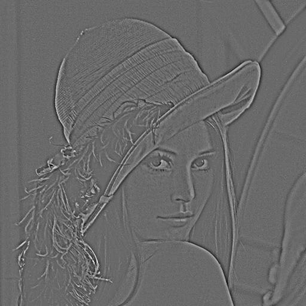

<a name="nn.convlayers.dok"></a>
# 컨볼루션 층 #

컨볼루션은 한 함수 `g`가 함수 다른 함수 `f`를 지나며 겹치는 요소들의 곱의 합입니다.
컨볼루션은 한 함수를 다른 함수와 "섞습니다". 신경망 패치키는 컨볼루션, 풀링, 서브샘플링, 그리고 
다른 관련 편의 장치들을 지원합니다. 이것은 입력과 출력 [텐서](https://github.com/torch/torch7/blob/master/doc/tensor.md#tensor)들의 
차원수에 따라 나뉩니다.

  * [시간적 모듈들](#nn.TemporalModules)은 1차원 시퀀스에 관련됩니다 (예를 들어, 단어들의 시퀀스, 음소들과 글자들, 그리고 문자열).
    * [TemporalConvolution (시간적 컨볼루션)](#nn.TemporalConvolution) : 한 입력 시퀀스에 대한 1차원 컨볼루션 ;
    * [TemporalSubSampling (시간적 서브샘플링)](#nn.TemporalSubSampling) : 한 입력 시퀀스에 대한 1차원 서브샘플링 ;
    * [TemporalMaxPooling (시간적 맥스 풀링)](#nn.TemporalMaxPooling) : 한 입력 시퀀스에 대한 1차원 맥스 풀링 연산 ;
    * [LookupTable (찾기 테이블)](#nn.LookupTable) : 폭이 `1`인 컨볼루션, 워드 임베딩(word embedding)을 위해 흔히 사용됨 ;
  * [공간적 모듈들](#nn.SpatialModules) 2차원 입력에 관련됩니다 (예를 들어, 영상들):
    * [SpatialConvolution (공간적 컨볼루션)](#nn.SpatialConvolution) : 한 입력 영상에 대한 2차원 컨볼루션 ;
    * [SpatialSubSampling (공간적 서브샘플링)](#nn.SpatialSubSampling) : 한 입력 영상에 대한 2차원 서브샘플링 ;
    * [SpatialMaxPooling (공간적 맥스 풀링)](#nn.SpatialMaxPooling) : 한 입력 영상에 대한 2차원 맥스 풀링 연산 ;
    * [SpatialFractionalMaxPooling (공간적 Fractional 맥스 풀링)](#nn.SpatialFractionalMaxPooling) : 한 입력 영상에 대한 2차원 fractional 맥스 풀링 연산 ;
    * [SpatialAveragePooling (공간적 평균 풀링)](#nn.SpatialAveragePooling) : 한 입력 영상에 대한 2차원 평균 풀링 연산 ;
    * [SpatialAdaptiveMaxPooling (공간적 적응 맥스 풀링)](#nn.SpatialAdaptiveMaxPooling) : 파라미터들을 역동적으로(dynamically) 고쳐나가는 고정 크기 출력을 가진 2차원 맥스 풀링 연산 ;
    * [SpatialLPPooling (공간적 LP 풀링)](#nn.SpatialLPPooling) : 한 입력 영상들의 집합에서 컨볼루셔널 방식으로 `p` 놈을 계산합니다 ;
    * [SpatialConvolutionMap (공간적 컨볼루션 맵)](#nn.SpatialConvolutionMap) : 일반적 연결 테이블(generic connection table)을 사용하는 2차원 컨볼루션 ;
    * [SpatialZeroPadding (공간적 영 채우기)](#nn.SpatialZeroPadding) : 특정된 개수의 `0`들로 한 특징 맵(feature map)을 채움 ;
    * [SpatialSubtractiveNormalization (공간적 빼기 정규화)](#nn.SpatialSubtractiveNormalization) : [SpatialBatchNormalization (공간적 배치 정규화)](#nn.SpatialBatchNormalization)을 사용한 일련의 2차원 입력들에 대한 공간적 빼기 연산 ;
    * [SpatialBatchNormalization (공간적 배치 정규화)](#nn.SpatialBatchNormalization): 주변지역(neighborhood) 안의 가중된 평균을 계산하기 위한 커널을 따르는 한 선택적 아핀 변환을 가지고, 미니배치 입력과 픽셀들에 대한 평균/표준편차 정규화 ;
    * [SpatialUpsamplingNearest (공간적 업샘플링 가장 가까운)](#nn.SpatialUpSamplingNearest): 특징 맵의 매 채널에 적용되는 한 단순한 업샘플러.
  * [부피적 모듈들](#nn.VolumetricModules) 3차원 입력에 관련됩니다 (이를테면 동영상들) :
    * [VolumetricConvolution (부피적 컨볼루션)](#nn.VolumetricConvolution) : 한 입력 동영상(영상들의 시퀀스 하나)에 대한 3차원 컨볼루션 ;
    * [VolumetricDeconvolution (부피적 디컨볼루션)](#nn.VolumetricDeconvolution) : 한 입력 동영상(영상들의 시퀀스 하나)에 대한 3차원 디컨볼루션 ;
    * [VolumetricMaxPooling (부피적 맥스 풀링)](#nn.VolumetricMaxPooling) : 한 입력 동영상에 대한 3차원 맥스 풀링 연산.
    * [VolumetricAveragePooling (부피적 평균 풀링)](#nn.VolumetricAveragePooling) : 한 입력 동영상에 대한 3차원 평균 풀링 연산.

<a name="nn.TemporalModules"></a>
## 시간적(temporal) 모듈들 ##
선택적 인자인 첫 번째 배치 차원을 제외하면, 시간적 층들은 2차원 텐서가 입력으로 들어올 것으로 기대합니다.
첫 번째 차원의 크기는 그 시퀀스 안에 있는 프레임 개수입니다 (이를테면 `nInputFrame`).
마지막 차원의 크기는 한 프레임 안에 있는 특징 개수입니다 (이를테면 `inputFrameSize`). 
비록 각 차원의 크기는 바뀔 수도 있지만, 출력은 보통 같은 크기의 차원을 가집니다.
시간적 모듈들은 보통 소리 신호 또는 단어들의 시퀀스(다시 말해, 자연 언어 처리)를 처리하는 데 사용됩니다. 

노트: [LookupTable](#nn.LookupTable)은 특별합니다. 왜냐하면 
[LookupTable](#nn.LookupTable)의 출력은 차원이 `nOutputFrame x outputFrameSize`인 시간적 텐서 하나인 반면,
[LookupTable](#nn.LookupTable)의 입력은 차원이 `nIndices`인 인덱스들을 가진 1차원 텐서이기 때문입니다.
다시 한 번 말하지만, 이것은 첫 번째 배치 차원을 제외합니다.

<a name="nn.TemporalConvolution"></a>
## TemporalConvolution (시간적 컨볼루션) ##

```lua
module = nn.TemporalConvolution(inputFrameSize, outputFrameSize, kW, [dW])
```

`nInputFrame` 프레임들로 구성된 한 입력 시퀀스에 대해 1차원 컨볼루션을 적용합니다.
`forward(input)`의 `input` 텐서는 
2차원 텐서 (`nInputFrame x inputFrameSize`) 또는 3차원 텐서 (`nBatchFrame x nInputFrame x inputFrameSize`)라고 
기대됩니다.

파라미터들은 다음과 같습니다:
  * `inputFrameSize`: `forward()`에 입력되는 입력 시퀀스의 프레임 개수.
  * `outputFrameSize`: 컨볼루션 층이 생성할 출력 프레임 개수.
  * `kW`: 컨볼루션의 커널 너비.
  * `dW`: 컨볼루션의 스텝(step). 기본 값은 `1`.

주의하십시오. 당신의 커널 크기에 따라, 
그 시퀀스의 몇몇 (그 마지막의) 프레임들은 짤릴 수도 있습니다. 
입력 시퀀스들에 적절한 패딩(padding) 프레임들을 추가하는 것은 사용자의 몫입니다. 

만약 입력 시퀀스가 차원이 `nInputFrame x inputFrameSize`인 2차원 텐서이면,
출력 시퀀스의 차원은 `nOutputFrame x outputFrameSize`일 것입니다. 여기서, 
```lua
nOutputFrame = (nInputFrame - kW) / dW + 1
```

만약 입력 시퀀스가 차원이 `nBatchFrame x nInputFrame x inputFrameSize`인 3차원 텐서이면,
출력 시퀀스의 차원은 `nBatchFrame x nOutputFrame x outputFrameSize`일 것입니다.

우리는 컨볼루션의 파라미터들을 
`self.weight` (크기가 `outputFrameSize x (inputFrameSize x kW)`인 텐서)와
`self.bias` (크기가 `outputFrameSize`인 텐서)에서 찾을 수 있습니다. 
그에 상응하는 기울기들은 `self.gradWeight`와 `self.gradBias`에서 찾을 수 있습니다.

2차원 입력을 위해, 그 층의 출력 값은 다음과 같이 정확하게 설명될 수 있습니다:
```lua
output[t][i] = bias[i]
  + sum_j sum_{k=1}^kW weight[i][j][k]
                                * input[dW*(t-1)+k)][j]
```

여기 한 간단한 예가 있습니다:
```lua
> require 'nn'
> inp=5  -- 한 시퀀스에 있는 프레임 개수 
> outp=1 -- 한 시퀀스 프레임을 위해 유도된 특징 개수
> kw=1   -- 스텝 당 오직 한 시퀀스 프레임에 대해서만 연산하는 커널
> dw=1   -- 한 스텝 움직입니다. 그리고 그다음 시퀀스 프레임으로 계속 진행합니다.

> mlp=nn.TemporalConvolution(inp,outp,kw,dw)

> mlp.weight
 0.2740  0.0081  0.4157  0.1198  0.2953
[torch.DoubleTensor of size 1x5]
> mlp.bias
 0.1485
[torch.DoubleTensor of size 1]

> x=torch.rand(7,inp) -- 7 프레임으로 구성된 한 시퀀스
> x
 0.3071  0.2370  0.1964  0.3261  0.8709
 0.4220  0.6326  0.7177  0.4861  0.8439
 0.2495  0.1980  0.6770  0.9709  0.0766
 0.0033  0.3745  0.7748  0.9743  0.9652
 0.5612  0.2216  0.1066  0.2672  0.5496
 0.3994  0.7125  0.4629  0.2480  0.1111
 0.8861  0.8240  0.4006  0.7038  0.5451
[torch.DoubleTensor of size 7x5]

> mlp:forward(x)
 0.6125    -- mlp.weight * x[1] + mlp.bias
 0.8751    -- mlp.weight * x[2] + mlp.bias
 0.6388    -- mlp.weight * x[3] + mlp.bias
 0.8763    -- mlp.weight * x[4] + mlp.bias
 0.5426    -- mlp.weight * x[5] + mlp.bias
 0.5187    -- mlp.weight * x[6] + mlp.bias
 0.8097    -- mlp.weight * x[7] + mlp.bias
[torch.DoubleTensor of size 7x1]
```


<a name="nn.TemporalMaxPooling"></a>
## TemporalMaxPooling (시간적 맥스 풀링) ##

```lua
module = nn.TemporalMaxPooling(kW, [dW])
```
폭 크기가 `kW`인 커널을 `dW` 스텝씩 이동시키며 1차원 맥스 풀링 연산을 적용합니다.
입력 시퀀스는 `nInputFrame`개 프레임으로 구성됩니다.
`forward(input)`의 `input` 텐서는 2차원 텐서(`nInputFrame x kW`) 또는
3차원 텐서(`nBatchFrame x nInputFrame x kW`)일 것으로 기대됩니다.

만약 입력 시퀀스가 `nInputFrame x kW` 2차원 텐서이면,
출력 시퀀스의 차원은 `nOutputFrame x kW`일 것입니다. 여기서,
```lua
nOutputFrame = (nInputFrame - kW) / dW + 1
```

예:
```lua
-- 입력 텐서가 2차원인 경우
th> x=torch.rand(5,2)
th> x
 0.2413  0.9529
 0.1680  0.1107
 0.1301  0.3916
 0.5944  0.2479
 0.3462  0.6947
[torch.DoubleTensor of size 5x2]

th> kw=2; dw=1; module=nn.TemporalMaxPooling(kw,dw)
th> module:forward(x)
 0.2413  0.9529
 0.1680  0.3916
 0.5944  0.3916
 0.5944  0.6947
[torch.DoubleTensor of size 4x2]

th> kw=2; dw=2; module=nn.TemporalMaxPooling(kw,dw)
th> module:forward(x)
 0.2413  0.9529
 0.5944  0.3916
[torch.DoubleTensor of size 2x2]

-- 입력 텐서가 3차원인 경우
th> y=torch.rand(2,3,4)
th> y
(1,.,.) = 
  0.9199  0.5620  0.8951  0.8885
  0.2133  0.8963  0.0945  0.5582
  0.7129  0.1385  0.8408  0.6387
(2,.,.) = 
  0.7527  0.9281  0.4658  0.8129
  0.8870  0.1589  0.4375  0.4281
  0.3699  0.1854  0.9651  0.1107
[torch.DoubleTensor of size 2x3x4]

th> kw=2; dw=1; module=nn.TemporalMaxPooling(kw,dw)
th> module:forward(y)
(1,.,.) = 
  0.9199  0.8963  0.8951  0.8885
  0.7129  0.8963  0.8408  0.6387
(2,.,.) = 
  0.8870  0.9281  0.4658  0.8129
  0.8870  0.1854  0.9651  0.4281
[torch.DoubleTensor of size 2x2x4]

th> kw=2; dw=2; module=nn.TemporalMaxPooling(kw,dw)
th> module:forward(y)
(1,.,.) = 
  0.9199  0.8963  0.8951  0.8885
(2,.,.) = 
  0.8870  0.9281  0.4658  0.8129
[torch.DoubleTensor of size 2x1x4]
```

<a name="nn.TemporalSubSampling"></a>
## TemporalSubSampling (시간적 서브샘플링) ##

```lua
module = nn.TemporalSubSampling(inputFrameSize, kW, [dW])
```
`nInputFrame`개 프레임으로 구성된 입력 시퀀스에 1차원 서브샘플링을 적용합니다. 
`forward(input)`의 `input` 텐서는 `nInputFrame x inputFrameSize` 2차원 텐서일 것으로 기대됩니다.
출력 프레임 크기는 입력 프레임 크기(`inputFrameSize`)와 같습니다.

파라미터들은 다음과 같습니다:
  * `inputFrameSize`: `forward()`로 입력되는 시퀀스들의 입력 프레임 크기.
  * `kW`: 서브샘플링의 커널 폭
  * `dW`: 서브샘플링의 한 스텝. 기본값은 `1`.

주의하십시오. 커널 크기에 따라, 
그 시퀀스의 (마지막) 몇 프레임들은 잘릴 수도 있습니다. 
입력 시퀀스에 적절한 패딩(padding) 프레임을 추가하는 것은 사용자의 몫입니다. 

만약 입력 시퀀스가 `nInputFrame x inputFrameSize` 2차원 텐서이면,
출력 시퀀스의 차원은 `inputFrameSize x nOutputFrame`일 것입니다. 여기서,
```lua
nOutputFrame = (nInputFrame - kW) / dW + 1
```

서브샘플링의 파라미터들은 
`self.weight`(크기가 `inputFrameSize`인 텐서)와
`self.bias`(크기가 `inputFrameSize`인 텐서)에 있습니다. 
그에 상응하는 기울기들은 `self.gradWeight`와 `self.gradBias`에 있습니다.

한 층의 출력 값은 다음 식으로 정확히 설명됩니다:
```lua
output[i][t] = bias[i] + weight[i] * sum_{k=1}^kW input[i][dW*(t-1)+k)]
```

예:
```lua
th> x=torch.rand(5,1)
th> x
 0.0440
 0.5360
 0.5026
 0.9827
 0.7965
[torch.DoubleTensor of size 5x1]

th> module=nn.TemporalSubSampling(1,2,1)
th> module.weight
-0.1413
[torch.DoubleTensor of size 1]
th> module.bias
-0.4414
[torch.DoubleTensor of size 1]
th> module:forward(x)
-0.5233    -- x[1]*module.weight + x[2]*module.weight + module.bias
-0.5881    -- x[2]*module.weight + x[3]*module.weight + module.bias
-0.6513    -- x[3]*module.weight + x[4]*module.weight + module.bias
-0.6928    -- x[4]*module.weight + x[5]*module.weight + module.bias
[torch.DoubleTensor of size 4x1]
```


<a name="nn.LookupTable"></a>
## LookupTable (찾기 테이블) ##

```lua
module = nn.LookupTable(nIndex, sizes)
```
또는
```lua
module = nn.LookupTable(nIndex, size1, [size2], [size3], ...)
```

이 층은 컨볼루션의 한 특별한 경우입니다, 여기서 그 컨볼루션의 폭은 `1`일 것입니다.
`forward(input)`를 호출할 때, `input`은 인덱스들로 채워진 1차원 또는 2차원 텐서라고 가정됩니다.
만약 `input`이 한 행렬이면, 각 행은 주어진 배치의 한 입력 샘플이라고 가정됩니다.
인덱스들은 `1`부터 `nIndex`까지의 범위를 가집니다.
각 인덱스를 위해, `LookupTable`은 상응하는 `Tensor`를 출력합니다.
그 출력되는 텐서의 차원은 `sizes` (`LongStorage`) 또는 `size1 x size2 x...`로 특정됩니다.

1차원 텐서가 주어지면, 출력 텐서들은 
`n x size1 x size2 x ... x sizeN` 텐서 하나로 이어붙여집니다. 
여기서 `n`은 1차원 `input` 텐서의 크기입니다.

다시 1차원 입력을 가지고, 오직 `size1`만 제공될 때, 
`forward(input)`는 효율적인 방법으로 다음 행렬-행렬 곱을 하는 것과 같습니다.
```lua
M P
```
여기서 `M`은 그 룩업-테이블의 파라미터들을 이어붙이는 `size1 x nIndex` 2차원 행렬입니다.
그리고 `P`는 2차원 행렬입니다, 여기서 각 열 벡터 `i`는 
`input[i]` 번째 인덱스만 `1`인 영 벡터입니다.

1차원 예:
```lua
 -- 크기가 3인 텐서 10개를 이어붙인 룩업 테이블
th> module = nn.LookupTable(10, 3)
th> module.weight
 0.7585 -1.1244  0.1838
 1.2089 -0.1248 -0.6083
 0.3365  0.3728 -0.0652
-0.7204 -0.9989 -0.6151
-0.3471 -0.3848  0.5774
-0.6170 -1.6148 -0.1772
 1.1960  1.1934  0.4701
-0.8309 -0.8724  0.3953
 0.6201  1.2429  0.7910
 1.2677  0.2019 -0.5145
[torch.DoubleTensor of size 10x3]

th> input = torch.Tensor{1,2,1,10}
th> module:forward(input)
 0.7585 -1.1244  0.1838    -- module.weight[1]
 1.2089 -0.1248 -0.6083    -- module.wieght[2]
 0.7585 -1.1244  0.1838    -- module.wieght[1]
 1.2677  0.2019 -0.5145    -- module.wieght[10]
[torch.DoubleTensor of size 4x3]
```
첫 번째 행 벡터가 세 번째 행 벡터와 같음에 유의하십시오!

`m x n` 2차원 입력 텐서가 주어지면, 
그 출력은 `m x n x size1 x size2 x ... x sizeN` 텐서입니다.
여기서 `m`은 그 배치안의 샘플 개수이고 
`n`은 샘플 당 인덱스 개수입니다.

2차원 예:
```lua
-- 크기가 3인 텐서 10개를 이어붙인 룩업 테이블
th> module = nn.LookupTable(10, 3)
th> module.weight
 0.7585 -1.1244  0.1838
 1.2089 -0.1248 -0.6083
 0.3365  0.3728 -0.0652
-0.7204 -0.9989 -0.6151
-0.3471 -0.3848  0.5774
-0.6170 -1.6148 -0.1772
 1.1960  1.1934  0.4701
-0.8309 -0.8724  0.3953
 0.6201  1.2429  0.7910
 1.2677  0.2019 -0.5145
[torch.DoubleTensor of size 10x3]

-- 인덱스 4개를 가진 샘플 2개로 구성된 묶음(batch)
th> input = torch.Tensor({{1,2,4,5},{4,3,2,10}})
th> module:forward(input)
(1,.,.) = 
  0.7585 -1.1244  0.1838    -- module.weight[1]
  1.2089 -0.1248 -0.6083    -- module.weight[2]
 -0.7204 -0.9989 -0.6151    -- module.weight[4]
 -0.3471 -0.3848  0.5774    -- module.weight[5]
(2,.,.) = 
 -0.7204 -0.9989 -0.6151    -- module.weight[4]
  0.3365  0.3728 -0.0652    -- module.weight[3]
  1.2089 -0.1248 -0.6083    -- module.weight[2]
  1.2677  0.2019 -0.5145    -- module.weight[10]
[torch.DoubleTensor of size 2x4x3]
```

<a name="nn.SpatialModules"></a>
## 공간적 모듈들 ##
선택적인 배치 차원을 제외하면, 공간적 층들의 입력은 3차원 텐서일 것으로 기대됩니다.
첫 번째 차원은 특징 개수(이를테면 `frameSize`)이고,
마지막 두 차원은 공간적(이를테면 `height x width`)입니다. 
공간적 모듈들은 보통 영상을 처리하는 데 사용됩니다.

<a name="nn.SpatialConvolution"></a>
### SpatialConvolution (공간적 컨볼루션) ###

```lua
module = nn.SpatialConvolution(nInputPlane, nOutputPlane, kW, kH, [dW], [dH], [padW], [padH])
```

몇 개의 입력 평면들로 구성된 한 입력에 대해 2차원 컨볼루션을 적용합니다. 
`forward(input)` 안의 `input` 텐서는 3차원(`nInputPlane x height x width`) 텐서일 것으로 기대됩니다.

파라미터들은 다음과 같습니다:
  * `nInputPlane`: `forward()`로 입력되는 영상 안에 있을 것으로 기대되는 입력 평면 개수.
  * `nOutputPlane`: 컨볼루션 층이 만들 출력 평면 개수.
  * `kW`: 컨볼루션의 커널 폭
  * `kH`: 컨볼루션의 커널 높이
  * `dW`: 폭 차원에서 커널의 스텝(이동 폭). 기본값은 `1`.
  * `dH`: 높이 차원에서 커널의 스텝(이동 폭). 기본값은 `1`.
  * `padW`: 입력 평면들에 폭 당 추가되는 추가적 `0`들. 기본값은 `0`. 한 가지 좋은 숫자는 `(kW-1)/2`.
  * `padH`: 입력 평면들에 높이 당 추가되는 추가적 `0`들. 기본값은 `padW`. 한 가지 좋은 숫자는 `(kH-1)/2`.

주의하십시오. 커널 크기에 따라, 
그 영상의 (마지막) 몇몇 열들 또는 행들이 잘릴 수도 있습니다. 
영상들에 적절한 패딩(padding)을 추가하는 것은 사용자의 몫입니다.

만약 입력 영상이 `nInputPlane x height x width` 3차원 텐서이면,
출력 영상의 차원은 `nOutputPlane x oheight x owidth`일 것입니다. 여기서,
```lua
owidth  = floor((width  + 2*padW - kW) / dW + 1)
oheight = floor((height + 2*padH - kH) / dH + 1)
```

컨볼루션의 파라미터들은 `self.weight`(차원이 `nOutputPlane x nInputPlane x kH x kW`인 텐서)와
`self.bias`(차원이 `nOutputPlane`인 텐서)에 있습니다.
그에 상응하는 기울기들은 `self.gradWeight`와 `self.gradBias`에 있습니다.

그 층의 출력 값은 다음 식으로 정확히 설명됩니다:
```lua
output[i][j][k] = bias[k]
  + sum_l sum_{s=1}^kW sum_{t=1}^kH weight[s][t][l][k]
                                    * input[dW*(i-1)+s)][dH*(j-1)+t][l]
```


<a name="nn.SpatialConvolutionMap"></a>
### SpatialConvolutionMap (공간적 컨볼루션 맵) ###

```lua
module = nn.SpatialConvolutionMap(connectionMatrix, kW, kH, [dW], [dH])
```

이 클래스는 [nn.SpatialConvolution](#nn.SpatialConvolution)의 일반화입니다.
이 클래스는 입력과 출력 특징들 사이 일반적 연결 테이블(generic connection table)을 사용합니다.
[nn.SpatialConvolution](#nn.SpatialConvolution)은 [full connection table (완전 연결 테이블)](#nn.tables.full)을 사용하는 것과 같습니다.
우리는 연결 테이블을 다른 타입들로 특정할 수 있습니다.


<a name="nn.tables.full"></a>
#### Full Connection Table (완전 연결 테이블) ####

```lua
table = nn.tables.full(nin,nout)
```

이것은 매 입력과 출력 노드 사이 연결들을 특정하는 미리 계산된 테이블입니다.


<a name="nn.tables.onetoone"></a>
#### One to One Connection Table (일대일 연결 테이블) ####

```lua
table = nn.tables.oneToOne(n)
```

이것은 각 입력에서 상응하는 각 출력 노트로의 한 단일 연결을 특정하는 미리 계산된 테이블입니다.


<a name="nn.tables.random"></a>
#### Random Connection Table (랜덤 연결 테이블) ####

```lua
table = nn.tables.random(nin,nout, nto)
```

이 테이블은 랜덤하게 추출됩니다. 이 테이블의 각 출력 유닛은 `nto`개의 들어오는 연결을 가집니다.
알고리즘은 각 입력 노드에 가능하면 균일한 수의 밖으로 나가는 연결들을 할당하려고 시도합니다.


<a name="nn.SpatialLPPooling"></a>
### SpatialLPPooling (공간적 LP 풀링) ###

```lua
module = nn.SpatialLPPooling(nInputPlane, pnorm, kW, kH, [dW], [dH])
```

2차원 입력 평면들로 구성된 집합에서 컨볼루션 방식으로 `p` 놈을 계산합니다.

<a name="nn.SpatialMaxPooling"></a>
### SpatialMaxPooling (공간적 맥스 풀링) ###

```lua
module = nn.SpatialMaxPooling(kW, kH [, dW, dH, padW, padH])
```

크기가 `kWxkH` 커널을 `dWxdH` 스텝씩 이동시키며 2차원 맥스 풀링 연산을 적용합니다.
출력 특징들의 개수는 입력 평면의 개수와 같습니다.

만약 입력 영상이 `nInputPlane x height x width` 3차원 텐서이면,
출력 영상의 차원은 `nOutputPlane x oheight x owidth`가 될 것입니다. 여기서,

```lua
owidth  = op((width  + 2*padW - kW) / dW + 1)
oheight = op((height + 2*padH - kH) / dH + 1)
```

`op`는 반올림 연산자입니다. 기본적으로 그 연산자는 `floor`(내림)입니다. 
`:ceil()` 또는 `:floor()` 메소드를 호출하여 `op`를 바꿀 수 있습니다.

<a name="nn.SpatialFractionalMaxPooling"></a>
### SpatialFractionalMaxPooling (공간적 Fractional 맥스 풀링) ###

```lua
module = nn.SpatialFractionalMaxPooling(kW, kH, outW, outH)
--   출력의 차원은 꼭 정확히 (outH x outW)이어야 합니다.
또는
module = nn.SpatialFractionalMaxPooling(kW, kH, ratioW, ratioH)
--   출력의 차원은 꼭 (floor(inH x ratioH) x floor(inW x ratioW))이어야 합니다.
--   ratios(비율들)은 (0, 1) 범위의 숫자들입니다.
```

[Ben Graham의 논문 "Fractional Max Pooling"](http://arxiv.org/abs/1412.6071)에 설명된 것처럼
"pseudorandom" 모드로 
2차원 Fractional 맥스 풀링 연산을 적용합니다.

맥스 풀링 연산은 `kW x kH` 크기의 커널을 타겟 출력 크기에 의해 결정된 통계적 스텝 크기씩 이동하며 적용됩니다.
출력 특징의 개수는 입력 평면 개수와 같습니다.

두 개의 생성자를 사용할 수 있습니다.

생성자 1:
```lua
module = nn.SpatialFractionalMaxPooling(kW, kH, outW, outH)
```

생성자 2:
```lua
module = nn.SpatialFractionalMaxPooling(kW, kH, ratioW, ratioH)
```
만약 입력 영상이 `nInputPlane x height x width` 3차원 텐서이면,
출력 영상의 차원은 `nOutputPlane x oheight x owidth`일 것입니다.

여기서

```lua
owidth  = floor(width * ratioW)
oheight = floor(height * ratioH)
```
ratio(비율)들은 (0, 1) 범위의 숫자들입니다. 


<a name="nn.SpatialAveragePooling"></a>
### SpatialAveragePooling (공간적 평균 풀링) ###

```lua
module = nn.SpatialAveragePooling(kW, kH [, dW, dH])
```
크기가 `kWxkH`인 커널을 `dWxdH` 스텝 크기씩 이동시키며 2차원 평균 풀링 연산을 적용합니다.
출력 특징 개수는 입력 평면 개수와 같습니다.


<a name="nn.SpatialAdaptiveMaxPooling"></a>
### SpatialAdaptiveMaxPooling (공간적 적응 맥스 풀링) ###

```lua
module = nn.SpatialAdaptiveMaxPooling(W, H)
```
한 영상에 2차원 맥스 풀링 연산을 적용합니다.
그 영상의 출력 차원은 `WxH`이고 입력 차원은 특정되지 않습니다.
출력 특징 개수는 입력 평면 개수와 같습니다.

차원이 `(owidth,oheight)`인 한 출력을 위한,
차원이 `(iwidth,iheight)`인 입력 영상에 있는 풀링 영역 `(j,i)`의 인덱스들은
다음과 같이 주어집니다.

```lua
x_j_start = floor((j   /owidth)  * iwidth)
x_j_end   = ceil(((j+1)/owidth)  * iwidth)

y_i_start = floor((i   /oheight) * iheight)
y_i_end   = ceil(((i+1)/oheight) * iheight)
```

<a name="nn.SpatialSubSampling"></a>
### SpatialSubSampling (공간적 서브샘플링) ###

```lua
module = nn.SpatialSubSampling(nInputPlane, kW, kH, [dW], [dH])
```
몇 개의 입력 평면으로 구성된 한 입력 영상에 대해 2차원 서브 샘플링을 적용합니다.
`forward(input)`의 `input` 텐서는 `nInputPlane x height x width` 3차원 텐서일 것으로 기대됩니다.
출력 평면의 개수는 `nInputPlane`과 같습니다.

파라미터들은 다음과 같습니다:
  * `nInputPlane`: `forward()`로 입력될 것으로 기대되는 영상의 입력 평면 개수.
  * `kW`: 서브 샘플링의 커널 폭
  * `kH`: 서브 샘플링의 커널 높이
  * `dW`: 폭 차원에서의 서브 샘플링 스텝. 기본값은 `1`.
  * `dH`: 높이 차원에서의 서브 샘플링 스텝. 기본값은 `1`.

주의하십시오. 커널 크기에 따라, 
그 영상의 (마지막) 몇몇 열들 또는 행들이 잘릴 수도 있습니다. 
영상들에 적절한 패딩(padding)을 추가하는 것은 사용자의 몫입니다.

만약 입력 영상이 `nInputPlane x height x width` 3차원 텐서이면,
출력 영상의 차원은 `nInputPlane x oheight x owidth`일 것입니다. 여기서,

```lua
owidth  = (width  - kW) / dW + 1
oheight = (height - kH) / dH + 1 .
```
서브 샘플링의 파라미터들은 `self.weight`(크기가 `nInputPlane`인 텐서)와 `self.bias`(크기가 `nInputPlane`인 텐서)에 있습니다.
그에 상응하는 기울기들은 `self.gradWeight`와 `self.gradBias`에 있습니다.

그 층의 출력 값은 다음 식으로 정확히 설명될 수 있습니다:
```lua
output[i][j][k] = bias[k]
  + weight[k] sum_{s=1}^kW sum_{t=1}^kH input[dW*(i-1)+s)][dH*(j-1)+t][k]
```

<a name="nn.SpatialUpSamplingNearest"></a>
### SpatialUpSamplingNearest (공간적 업 샘플링 가장 가까운) ###

```lua
module = nn.SpatialUpSamplingNearest(scale)
```
몇 개의 입력 평면으로 구성된 한 입력 영상에 대해 2차원 업 샘플링을 적용합니다.
`forward(input)` 안의 `input` 텐서는 3차원 또는 4차원 텐서일 것으로 기대됩니다
(다시 말해, 4차원이면: `nBatchPlane x nInputPlane x height x width`).
출력 평면 개수는 같을 것입니다.
v 차원은 두 번째 마지막 차원으로 가정되고 (다시 말해, 4차원이면 세 번째 차원), 
u 차원은 마지막 차원으로 가정됩니다.

파라미터들은 다음과 같습니다:
  * `scale`: 업스케일 비율. 반드시 양의 정수여야 합니다.

업스케일 메소드는 단순한 최근접 이웃(nearest neighbor)입니다, 다시 말해:

```lua
output(u,v) = input(floor((u-1)/scale)+1, floor((v-1)/scale)+1)
```

여기서 `u`와 `v`는 (루아 규범대로) 1부터 시작하는 인덱스입니다.
학습할 수 있는 파라미터들은 없습니다.

<a name="nn.SpatialZeroPadding"></a>
### SpatialZeroPadding (공간적 영 채우기) ###

```lua
module = nn.SpatialZeroPadding(padLeft, padRight, padTop, padBottom)
```

주어진 입력의 각 특징 맵은 특정된 개수의 0들로 채워집니다.
만약 채우기 값들이 음수이면, 입력은 잘립니다.

<a name="nn.SpatialSubtractiveNormalization"></a>
### SpatialSubtractiveNormalization (공간적 빼기 정규화) ###

```lua
module = nn.SpatialSubtractiveNormalization(ninputplane, kernel)
```
일련의 2차원 입력들에 공간적 빼기 연산을 적용합니다. 
인접 지역(neighborhood) 안의 가중된 평균을 계산하기 위해, 연산에는 `kernel`이 사용됩니다.
인접 지역은 한 지역 공간적 영역을 위해 정의됩니다.
그 영역의 차원은 커널과 같고 모든 특징 전체에 걸칩니다. 
한 입력 영상을 위해, 오직 하나의 특징만 있으므로, 그 영역은 오직 공간적입니다.
한 RGB 영상을 위해, RGB 채널들과 한 공간적 영역에 가중된 평균이 취해집니다.

만약 `kernel`이 1차원이면, 그 `kernel`은 생성(constructing)과 구분할 수 있는 2차원 커널을 위해 사용됩니다.
이 경우, 그 연산들은 훨씬 더 효율적일 것입니다.

두 픽셀 위치의 상관(correlation)이 거리가 증가함에 따라 감소할 때, 
커널은 일반적으로 가우시안으로 선택됩니다.
특징 차원 상에서는, 한 균일한 평균이 사용됩니다. 
왜냐하면 특징 전체에 걸친 가중치는 알 수 없기 때문입니다.

이 예를 위해, 우리는 외부 패키지 하나를 사용합니다.
[image](http://www.github.com/clementfarabet/lua---image/)

```lua
require 'image'
require 'nn'
lena = image.rgb2y(image.lena())
ker = torch.ones(11)
m=nn.SpatialSubtractiveNormalization(1,ker)
processed = m:forward(lena)
w1=image.display(lena)
w2=image.display(processed)
```


<a name="nn.SpatialBatchNormalization"></a>
## SpatialBatchNormalization (공간적 배치 정규화) ##

`module` = `nn.SpatialBatchNormalization(N [,eps] [, momentum] [,affine])`
여기서 `N`은 입력 특징 맵들의 개수입니다.
`eps`는 0으로 나누는 오류를 피하기 위해 표준 편차에 더해지는 작은 값입니다. 기본값은 1e-5입니다.
`affine`은 불 방식(boolean)입니다. `false`로 설정되면, 학습할 수 있는 아핀 변환이 비활성화됩니다.
기본값은 `true`입니다.

다음 논문에 설명된 배치 정규화를 구현합니다: Sergey Ioffe, Christian Szegedy, 
   "Batch Normalization: Accelerating Deep Network Training
                         by Reducing Internal Covariate Shift"

그 연산은 다음과 같이 구현됩니다:
```
   y =     ( x - mean(x) )
        -------------------- * gamma + beta
       standard-deviation(x)
```
여기서 평균과 표준 편차는 미니배치들과 픽셀들에 대해, 특징 맵(feature map)당 계산됩니다. 
감마와 베타는 크기가 `N`(특징 맵들의 개수)인 학습할 수 있는 파라미터 벡터들입니다.
감마와 베타의 학습은 선택적입니다.

   훈련 시, 이 층은 계산된 평균과 표준편차의 누적 추정을 계속 유지합니다.
   (오버라이드 되지 않는 이상) 누적 합은 기본 모멘텀(momentup, 오타인지 확인 필요) 0.1로 유지됩니다.
   시험 시, 이 누적 평균과 표준 편차는 정규화 하는 데 사용됩니다.

그 모듈은 오직 4차원 입력들만 받습니다.

```lua
-- 학습할 수 있는 파라미터들을 가지고 
model = nn.SpatialBatchNormalization(m)
A = torch.randn(b, m, h, w)
C = model:forward(A)  -- C의 차원은 `b x m x h x w`일 것입니다

-- 학습할 수 있는 파라미터들 없이
model = nn.SpatialBatchNormalization(m, nil, nil, false)
A = torch.randn(b, m, h, w)
C = model:forward(A)  -- C의 차원은 `b x m x h x w`일 것입니다
```

<a name="nn.VolumetricModules"></a>
## Volumetric Modules (부피적 모듈들) ##
선택적인 배치 차원을 제외하면, 부피적 층들의 입력은 4차원 텐서일 것으로 기대됩니다.
첫 번째 차원은 특징 개수입니다 (이를테면 `frameSize`).
두 번째는 순차적(예를 들어, `time`)이고 마지막 두 차원은 공간적(예를 들어, `height x width`)입니다.
부피적 모듈들은 흔히 동영상(영상들의 시퀀스)을 처리하는 데 사용됩니다.


<a name="nn.VolumetricConvolution"></a>
### VolumetricConvolution (부피적 컨볼루션) ###

```lua
module = nn.VolumetricConvolution(nInputPlane, nOutputPlane, kT, kW, kH [, dT, dW, dH])
```
몇 개의 입력 평면으로 구성된 한 입력 영상에 대해 3차원 컨볼루션을 적용합니다.
`forward(input)`의 `input` 텐서는 `nInputPlane x time x height x width` 4차원 텐서일 것으로 기대됩니다.

파라미터들은 다음과 같습니다:
  * `nInputPlane`: `forward()`로 입력될 것으로 기대되는 영상의 입력 평면 개수.
  * `nOutputPlane`: 컨볼루션 층이 생성할 출력 평면 개수.
  * `kT`: 시간에서의 컨볼루션 커널 크기
  * `kW`: 컨볼루션의 커널 폭
  * `kH`: 컨볼루션의 커널 높이
  * `dT`: 시간 차원에서, 컨볼루션의 스텝. 기본값은 `1`.
  * `dW`: 폭 차원에서, 컨볼루션의 스텝. 기본값은 `1`.
  * `dH`: 높이 차원에서, 컨볼루션의 스텝. 기본값은 `1`.

주의하십시오. 커널 크기에 따라, 
그 영상의 (마지막) 몇몇 열들 또는 행들이 잘릴 수도 있습니다. 
영상들에 적절한 패딩(padding)을 추가하는 것은 사용자의 몫입니다.

만약 입력 영상이 `nInputPlane x time x height x width` 4차원 텐서이면,
출력 영상의 차원은 `nOutputPlane x otime x owidth x oheight`일 것입니다. 여기서,
```lua
otime   = (time  - kT)  / dT + 1
owidth  = (width  - kW) / dW + 1
oheight = (height - kH) / dH + 1 .
```

컨볼루션의 파라미터들은 `self.weight`(크기가 `nOutputPlane x nInputPlane x kT x kH x kW`인 텐서)와 
`self.bias`(크기가 `nOutputPlane`인 텐서)에 있습니다.
상응하는 기울기들은 `self.gradWeight`와 `self.gradBias`에 있습니다.


<a name="nn.VolumetricDeconvolution"></a>
### VolumetricDeconvolution (부피적 디컨볼루션) ###

```lua
module = nn.VolumetricDeconvolution(nInputPlane, nOutputPlane, kT, kW, kH, [dT], [dW], [dH], [padT], [padW], [padH])
```

몇 개의 입력 평면들로 구성된 한 입력 영상에 3차원 디컨볼루션을 적용합니다.
`forward(input)`의 `input` 텐서는 4차원 또는 5차원 텐서일 것으로 기대됩니다.

파라미터들은 다음과 같습니다:
* `nInputPlane`: `forward()`로 입력될 것으로 기대되는 영상의 입력 평면 개수.
* `nOutputPlane`: 컨볼루션 층이 생성할 출력 평면 개수
* `kT`: 디컨볼루션의 커널 깊이
* `kW`: 디컨볼루션의 커널 폭
* `kH`: 디컨볼루션의 커널 높이
* `dT`: 깊이 차원에서, 디컨볼루션의 스텝. 기본값은 `1`.
* `dW`: 폭 차원에서, 디컨볼루션의 스텝. 기본값은 `1`.
* `dH`: 높이 차원에서, 디컨볼루션의 스텝. 기본값은 `1`.
* `padT`: 입력 평면들에 깊이 당 추가되는 추가적인 `0`들. 기본값은 `0`. 한 가지 좋은 숫자는 `(kT-1)/2`.
* `padW`: 입력 평면들에 폭 당 추가되는 추가적인 `0`들. 기본값은 `0`. 한 가지 좋은 숫자는 `(kW-1)/2`.
* `padH`: 입력 평면들에 높이 당 추가되는 추가적인 `0`들. 기본값은 `0`. 한 가지 좋은 숫자는 `(kH-1)/2`.

만약 입력 영상이 `nInputPlane x depth x height x width` 3차원 텐서이면,
출력 영상의 차원은 `nOutputPlane x odepth x oheight x owidth`일 것입니다. 여기서,
```lua
odepth  = (depth  - 1) * dT - 2*padT + kT
owidth  = (width  - 1) * dW - 2*padW + kW
oheight = (height - 1) * dH - 2*padH + kH
```

<a name="nn.VolumetricMaxPooling"></a>
### VolumetricMaxPooling (부피적 맥스 풀링) ###

```lua
module = nn.VolumetricMaxPooling(kT, kW, kH [, dT, dW, dH])
```

차원이 `kTxkWxkH`인 커널을 스텝 크기 `dTxdWxdH`씩 이동시키며 3차원 맥스 풀링 연산을 적용합니다.
출력 특징 개수는 입력 평면 개수 / dT와 같습니다.

<a name="nn.VolumetricAveragePooling"></a>
### VolumetricAveragePooling ###

```lua
module = nn.VolumetricAveragePooling(kT, kW, kH [, dT, dW, dH])
```

차원이 `kTxkWxkH`인 커널을 스텝 크기 `dTxdWxdH`씩 이동시키며 3차원 평균 풀링 연산을 적용합니다.
출력 특징 개수는 입력 평면 개수 / dT와 같습니다.
