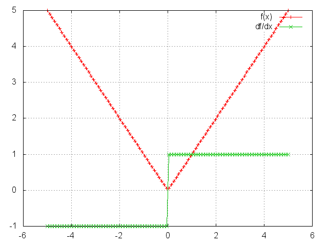
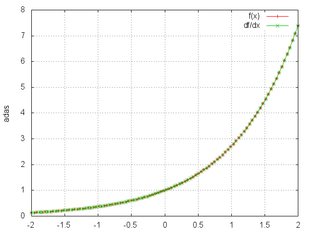
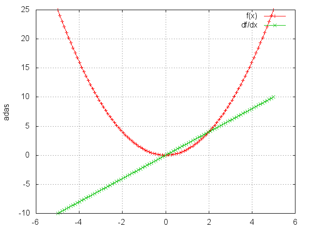
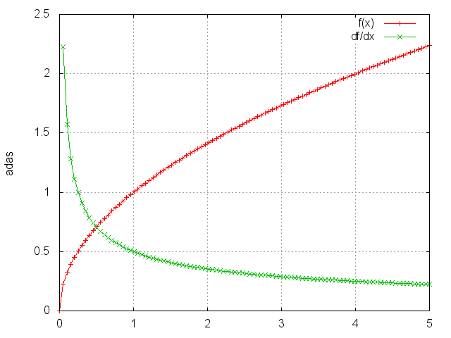
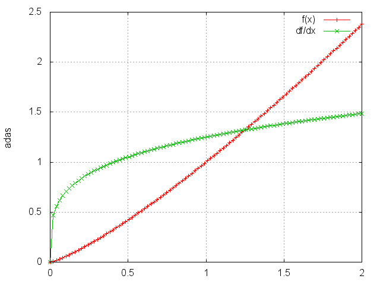

<a name="nn.simplelayers.dok"></a>
# 단순 층들 #
단순 모듈들은 텐서 메소드 적응과 아핀 변환 제공과 같은 다양한 작업에 사용됩니다:

  * 파라미터화 모듈들 :
    * [Linear](#nn.Linear) : 선형 변환 ;
    * [SparseLinear](#nn.SparseLinear) : 희소(sparse) 입력을 가진 선형 변환 ;
    * [Add](#nn.Add) : 들어오는 데이터에 바이어스 항을 추가 ;
    * [Mul](#nn.Mul) : 들어오는 데이터에 한 단일 스칼라 요소를 곱함 ;
    * [CMul](#nn.CMul) : 들어오는 데이터에 대한 요소별 곱 ;
    * [Euclidean](#nn.Euclidean) : 입력의 유클리디안 거리 `k` 평균 중심들로 ;
    * [WeightedEuclidean](#nn.WeightedEuclidean) : [Euclidean](#nn.Euclidean)과 비슷함, 그러나 추가적으로 대각 공분산 행렬을 학습함 ;
  * 기본적 텐서 메소드들을 개작한 모듈들 :
    * [Copy](#nn.Copy) : [type](https://github.com/torch/torch7/blob/master/doc/tensor.md#tensor-or-string-typetype) 캐스팅을 가진 입력의 [copy](https://github.com/torch/torch7/blob/master/doc/tensor.md#torch.Tensor.copy) ;
    * [Narrow](#nn.Narrow) : 주어진 차원에 대한 [narrow](https://github.com/torch/torch7/blob/master/doc/tensor.md#tensor-narrowdim-index-size) 연산 ;
    * [Replicate](#nn.Replicate) : 첫 번째 차원을 따라 입력으로 `n`번 [repeats](https://github.com/torch/torch7/blob/master/doc/tensor.md#tensor-repeattensorresult-sizes) ; 
    * [Reshape](#nn.Reshape) : 입력의 [reshape](https://github.com/torch/torch7/blob/master/doc/maths.md#res-torchreshaperes-x-m-n) ;
    * [View](#nn.View) : 입력의 [view](https://github.com/torch/torch7/blob/master/doc/tensor.md#result-viewresult-tensor-sizes) ;
    * [Select](#nn.Select) : 주어진 차원에 대한 [select](https://github.com/torch/torch7/blob/master/doc/tensor.md#tensor-selectdim-index) ;
    * [Index](#nn.Index) : 주어진 차원에 대한 [index](https://github.com/torch/torch7/blob/master/doc/tensor.md#tensor-indexdim-index) ;
  * 수학적 텐서 메소드들을 개작한 모듈들 :
    * [Max](#nn.Max) : 주어진 차원에 대한 [max](https://github.com/torch/torch7/blob/master/doc/maths.md#torch.max) 연산 ;
    * [Min](#nn.Min) : 주어진 차원에 대한 [min](https://github.com/torch/torch7/blob/master/doc/maths.md#torchminresval-resind-x) 연산 ;
    * [Mean](#nn.Mean) : 주어진 차원에 대한 [mean](https://github.com/torch/torch7/blob/master/doc/maths.md#res-torchmeanres-x-dim) 연산 ;
    * [Sum](#nn.Sum) : 주어진 차원에 대한 [sum](https://github.com/torch/torch7/blob/master/doc/maths.md#res-torchsumres-x) 연산 ;
    * [Exp](#nn.Exp) : 요소별 [exp](https://github.com/torch/torch7/blob/master/doc/maths.md#res-torchexpres-x) 연산 ;
    * [Abs](#nn.Abs) : 요소별 [abs](https://github.com/torch/torch7/blob/master/doc/maths.md#res-torchabsres-x) 연산 ;
    * [Power](#nn.Power) : 요소별 [pow](https://github.com/torch/torch7/blob/master/doc/maths.md#res-torchpowres-x) 연산 ;
    * [Square](#nn.Square) : 요소별 제곱 연산 ;
    * [Sqrt](#nn.Sqrt) : 요소별 [sqrt(제곱근)](https://github.com/torch/torch7/blob/master/doc/maths.md#res-torchsqrtres-x) 연산 ;
    * [Clamp](#nn.Clamp) : 요소별 [clamp](https://github.com/torch/torch7/blob/master/doc/maths.md#res-torchclampres-tensor1-min_value-max_value) 연산 ;
    * [Normalize](#nn.Normalize) : 입력이 `L_p` 놈을 갖도록 정규화 ;
    * [MM](#nn.MM) : 행렬-행렬 곱 (행렬들의 묶음들도 지원함) ;
  * 그 밖의 모듈들 :
    * [BatchNormalization](#nn.BatchNormalization) : 미니배치 입력들에 대한 평균/표준편차 정규화 (선택적인 아핀 변환과 함께) ;
    * [Identity](#nn.Identity) : 입력을 출력으로 그대로 내보내는 네트워크 ([ParallelTable](table.md#nn.ParallelTable)과 함께 유용함) ;
    * [Dropout](#nn.Dropout) : [bernoulli](http://en.wikipedia.org/wiki/Bernoulli_distribution) 분포에서 추출한 이진 샘플들을 사용하여 `input`의 일부를 덮어 씌움(mask) ;
    * [SpatialDropout](#nn.SpatialDropout) : 드롭아웃과 같으나 인접한 픽셀들이 강하게 상관된(correlated) 공간적 입력들을 위한 것입니다 ; 
    * [Padding](#nn.Padding) : 한 차원에 패디을 추가 ;
    * [L1Penalty](#nn.L1Penalty) : 입력에 L1 패널티를 추가 [희소함(sparsity)을 위해] ;
    * [GradientReversal](#nn.GradientReversal) : 기울기를 뒤집음 (목적 함수를 최대화하기 위해) ;

<a name="nn.Linear"></a>
## Linear ##

```lua
module = nn.Linear(inputDimension, outputDimension)
```

들어오는 데이터에 선형 변환 `y = Ax + b`를 적용합니다.
`forward(input)`로 주어지는 `input` 텐서는 반드시 벡터(1차원 텐서) 또는 행렬(2차원 텐서)이어야 합니다.
만약 입력이 행렬이면, 각 행은 주어진 묶음(batch)의 한 입력 샘플로 가정됩니다.

우리는 층 하나를 다음과 같이 만들 수 있습니다:

```lua
 module = nn.Linear(10, 5)  -- 입력 10, 출력 5
```

보통 이 층은 몇몇 종류의 네트워크에 추가됩니다, 예를 들어:

```lua
 mlp = nn.Sequential()
 mlp:add(module)
```

우리는 가중치들과 바이어스들(_A_ and _b_)을 다음과 같이 볼 수 있습니다:

```lua
 print(module.weight)
 print(module.bias)
```

우리는 이 가중치들을 위한 기울기를 다음과 같이 볼 수 있습니다:

```lua
 print(module.gradWeight)
 print(module.gradBias)
```

`nn` 모듈들이 늘 그렇듯, 선형 변환을 적용하는 것은 다음과 같이 수행됩니다:

```lua
x = torch.Tensor(10) -- 입력 10
y = module:forward(x)
```

<a name="nn.SparseLinear"></a>
## SparseLinear ##

```lua
module = nn.SparseLinear(inputDimension, outputDimension)
```

들어오는 희소(sparse) 데이터에 선형 변환 `y = Ax + b`를 적용합니다.
`forward(input)`로 주어지는 `input` 텐서는 반드시 torch.Tensor(N, 2) 형태의 2차원 텐서로 표현되는 희소 벡터여야 합니다. 여기서 그 쌍(행)들은 인덱스들과 값들을 나타냅니다.
`SparseLinear` 층은 입력 차원이 매우 크고 입력 데이터는 희소할 때 유용합니다.

우리는 희소 선형 층 하나를 다음과 같이 만들 수 있습니다:

```lua
module = nn.SparseLinear(10000, 2)  -- 입력 10000개, 출력 2개
```

희소 선형 모듈은 더 큰 네트워크의 일부로도 쓰일 수 있습니다. 그리고 입력의 형태를 제외하고,
[SparseLinear](#nn.SparseLinear)는 [Linear](#nn.Linear)와 정확히 같은 방식으로 동작합니다.

희소 입력 벡터는 그래서 다음과 같이 만들어질 수 있습니다...

```lua
x = torch.Tensor({ {1, 0.1}, {2, 0.3}, {10, 0.3}, {31, 0.2} })

 print(x)
  1.0000   0.1000
  2.0000   0.3000
 10.0000   0.3000
 31.0000   0.2000
[torch.Tensor of dimension 4x2]

th> module.weight:size()
     2
 10000
[torch.LongStorage of size 2]

th> module.bias
1e-09 *
 3.6695
-7.7798
[torch.DoubleTensor of size 2]
```

첫 번째 열에는 인덱스들이 저장됩니다. 두 번째 열에는 모든 다른 요소가 `0`인 한 벡터 안에 있는 값들이 저장됩니다.
인덱스들은 언급된 층으로의 입력 차원(이 예제에서는 10000)을 넘지 않아야 합니다.


<a name="nn.Dropout"></a>
## Dropout ##

```lua
module = nn.Dropout(p)
```

훈련하는 동안, `Dropout`은 `input`의 일부를 [베르누이](http://en.wikipedia.org/wiki/Bernoulli_distribution) 분포에서 추출한 이진 샘플들을 사용하여 덮어 씌웁니다.
각 `input` 요소는 떨어져나갈(dropped) 확률 `p`를 가집니다.
여기서 떨어져 나간다는 말은 그 출력 요소가 영이 된다는 뜻입니다.
이것은 레귤러라이제이션과 뉴런들의 공적응을 막는 데 효과적인 것으로 증명되었습니다.
([Hinton 외 2012](http://arxiv.org/abs/1207.0580)를 보십시오).

게다가, 그 출력들은 훈련 동안 `1/(1-p)`로 곱해집니다.
이것은 평가(evaluation) 동안 `input`이 그대로 `forward`되도록 합니다.

이 예제에서, 우리는 드롭아웃 하기 위해, 주어진 같은 `input`으로 
어떻게 [forward](module.md#output-forwardinput) 호출이 다른 `output`들을 샘플하는지를 시연합니다:


```lua
module = nn.Dropout()

> x = torch.Tensor{{1, 2, 3, 4}, {5, 6, 7, 8}}

> module:forward(x)
  2   0   0   8
 10   0  14   0
[torch.DoubleTensor of dimension 2x4]

> module:forward(x)
  0   0   6   0
 10   0   0   0
[torch.DoubleTensor of dimension 2x4]
```

[Backward](module.md#gradinput-backwardinput-gradoutput)는 같은 위치에 있는 기울기들을 `0`으로 만듭니다:

```lua
> module:forward(x)
  0   4   0   0
 10  12   0  16
[torch.DoubleTensor of dimension 2x4]

> module:backward(x, x:clone():fill(1))
 0  2  0  0
 2  2  0  2
[torch.DoubleTensor of dimension 2x4]
```

두 경우에서 `gradOutput`과 `input`은 `1/(1-p)`로 곱해집니다. 이 경우에서는 `2`로 곱해졌습니다.

[evaluation](module.md#evaluate) 동안, `Dropout`은 `input`의 모든 요소들이 고려되는 
`forward(input)`을 수행합니다.

```lua
> module:evaluate()

> module:forward(x)
 1  2  3  4
 5  6  7  8
[torch.DoubleTensor of dimension 2x4]
```

우리는 먼저 [Module:training()](module.md#training)을 호출함으로써 
훈련을 다시 시작할 수 있습니다:

```lua
> module:training()

> return module:forward(x)
  2   4   6   0
  0   0   0  16
[torch.DoubleTensor of dimension 2x4]
```

사용될 때, `Dropout`은 보통 
[Linear](#nn.Linear)같은 파라미터화 [Modules](module.md#nn.Module) 또는 
[SpatialConvolution](convolution.md#nn.SpatialConvolution)로 구성된 입력에 적용되어야 합니다.
숨겨진 층들(hidden layers)을 위한 `p` 값으로는 보통 `0.5`(기본값) 정도면 괜찮습니다.
`Dropout`은 종종 `0.2` 쯤의 `p` 값을 가진 데이터세트 입력들에 성공적으로 사용될 수 있습니다.
`Dropout`은 종종 [ReLU](transfer.md#nn.ReLU) 같은 [Transfer](transfer.md) 모듈들 뒤에서 가장 잘 동작합니다.
이 모든 것들은 데이터세트에 매우 크게 의존적입니다.
그러므로 사용자는 여러가지 다른 조합들을 시험해 볼 필요가 있습니다.


<a name="nn.SpatialDropout"></a>
## SpatialDropout ##

`module` = `nn.SpatialDropout(p)`

이 버전은 ```nn.Dropout```과 같은 기능을 수행합니다.
그러나 이 버전은 입력의 가장 오른쪽 두 차원들을 공간적이라고 가정하고,
훈련 시 출력 특징당 한 번의 [베르누이 시행](https://ko.wikipedia.org/wiki/%EB%B2%A0%EB%A5%B4%EB%88%84%EC%9D%B4_%EC%8B%9C%ED%96%89)을 수행하고,
전체 특징 맵에 걸쳐 이 드롭아웃 값을 확장합니다.

["Efficient Object Localization Using Convolutional Networks"](http://arxiv.org/abs/1411.4280) 논문에 설명되었듯, 
만약 특징 맵들 안의 인접한 픽셀들이 강하게 상관되면(correlated) (이전 컨볼루션 층들에서의 보통 경우 같이),
iid 드롭아웃은 그 활동들을 레귤러라이즈하지 않을 것이고, 
그렇지 않으면 단지 효과적 학습율 감소를 유발할 것입니다.
이 경우, ```nn.SpatialDropout```은 특징 맵들 사이의 독립성 촉진을 도울 것이고,
대신 사용되어야 합니다.

```nn.SpatialDropout```은 3차원 또는 4차원 입력을 받습니다.
만약 입력이 3차원이면, (features x height x width)인 층이 가정됩니다.
그리고 4차원을 위해서는 (batch x features x height x width)인 층이 가정됩니다.


<a name="nn.Abs"></a>
## Abs ##

```lua
module = Abs()
```

```lua
m = nn.Abs()
ii = torch.linspace(-5, 5)
oo = m:forward(ii)
go = torch.ones(100)
gi = m:backward(ii, go)
gnuplot.plot({'f(x)', ii, oo, '+-'}, {'df/dx', ii, gi, '+-'})
gnuplot.grid(true)
```




<a name='nn.Add'></a>
## Add ##

```lua
module = nn.Add(inputDimension, scalar)
```

바이어스 항을 들어오는 데이터에 적용합니다, 다시 말해, `yi = x_i + b_i`,
또는 만약 `scalar = true`이면, 단일 바이어스 항을 사용합니다, `yi = x_i + b`.

예:

```lua
y = torch.Tensor(5)
mlp = nn.Sequential()
mlp:add(nn.Add(5))

function gradUpdate(mlp, x, y, criterion, learningRate)
   local pred = mlp:forward(x)
   local err = criterion:forward(pred, y)
   local gradCriterion = criterion:backward(pred, y)
   mlp:zeroGradParameters()
   mlp:backward(x, gradCriterion)
   mlp:updateParameters(learningRate)
   return err
end

for i = 1, 10000 do
   x = torch.rand(5)
   y:copy(x);
   for i = 1, 5 do y[i] = y[i] + i; end
   err = gradUpdate(mlp, x, y, nn.MSECriterion(), 0.01)
end

print(mlp:get(1).bias)
```

는 다음을 출력합니다:

```lua
 1.0000
 2.0000
 3.0000
 4.0000
 5.0000
[torch.Tensor of dimension 5]
```

다시 말해, 네트워크는 입력 `x`가 출력 `y`를 만들기 위해 쉬프트(shift)되는 것을 
성공적으로 학습합니다.


<a name="nn.Mul"></a>
## Mul ##

```lua
module = nn.Mul()
```

_단일_ 스케일(scale) 요소를 들어오는 데이터에 적용합니다, 다시 말해 `y = w x`,
여기서 `w`는 스칼라입니다.

예:

```lua
y = torch.Tensor(5)
mlp = nn.Sequential()
mlp:add(nn.Mul())

function gradUpdate(mlp, x, y, criterion, learningRate)
   local pred = mlp:forward(x)
   local err = criterion:forward(pred, y)
   local gradCriterion = criterion:backward(pred, y)
   mlp:zeroGradParameters()
   mlp:backward(x, gradCriterion)
   mlp:updateParameters(learningRate)
   return err
end

for i = 1, 10000 do
   x = torch.rand(5)
   y:copy(x)
   y:mul(math.pi)
   err = gradUpdate(mlp, x, y, nn.MSECriterion(), 0.01)
end

print(mlp:get(1).weight)
```

는 다음을 출력합니다:

```lua
 3.1416
[torch.Tensor of dimension 1]
```

다시 말해, 네트워크는 입력 `x`가 pi로 크기가 바뀌는 것을 학습합니다.

<a name='nn.CMul'></a>
## CMul ##

```lua
module = nn.CMul(size)
```

요소별 곱을 들어오는 데이터에 적용합니다, 다시 말해 `y_i = w_i * x_i`. 
인자 `size`는 하나, 또는 많은 숫자들 (sizes), 또는 `torch.LongStorage`일 수 있습니다.
예를 들어, `nn.CMul(3,4,5)`는 `nn.CMul(torch.LongStorage{3,4,5})`과 같습니다.

예:

```lua
mlp = nn.Sequential()
mlp:add(nn.CMul(5))

y = torch.Tensor(5)
sc = torch.Tensor(5)
for i = 1, 5 do sc[i] = i; end -- 입력으로 이것으로 크기 변경합니다

function gradUpdate(mlp, x, y, criterion, learningRate)
   local pred = mlp:forward(x)
   local err = criterion:forward(pred, y)
   local gradCriterion = criterion:backward(pred, y)
   mlp:zeroGradParameters()
   mlp:backward(x, gradCriterion)
   mlp:updateParameters(learningRate)
   return err
end

for i = 1, 10000 do
   x = torch.rand(5)
   y:copy(x)
   y:cmul(sc)
   err = gradUpdate(mlp, x, y, nn.MSECriterion(), 0.01)
end

print(mlp:get(1).weight)
```

는 다음을 출력합니다:

```lua
 1.0000
 2.0000
 3.0000
 4.0000
 5.0000
[torch.Tensor of dimension 5]
```

다시 말해, 네트워크는 입력 `x`가 출력 `y`를 만들기 위해 
스케일링 요소들로 크기 변경되는 것을 학습합니다.


<a name="nn.Max"></a>
## Max ##

```lua
module = nn.Max(dimension)
```

차원 `dimension`에 대해 최댓값 연산을 적용합니다.
따라서, 만약 `nxpxq` 텐서가 입력으로 주어졌고 `dimension` = `2` 였다면,
`nxq` 행렬이 출력이었을 것입니다.


<a name="nn.Min"></a>
## Min ##

```lua
module = nn.Min(dimension)
```

차원 `dimension`에 대해 최솟값 연산을 적용합니다.
따라서, 만약 `nxpxq` 텐서가 입력으로 주어졌고 `dimension` = `2` 였다면,
`nxq` 행렬이 출력이었을 것입니다.


<a name="nn.Mean"></a>
## Mean ##

```lua
module = nn.Mean(dimension)
```

차원 `dimension`에 대해 평균 연산을 적용합니다.
따라서, 만약 `nxpxq` 텐서가 입력으로 주어졌고 `dimension` = `2` 였다면,
`nxq` 행렬이 출력이었을 것입니다.


<a name="nn.Sum"></a>
## Sum ##

```lua
module = nn.Sum(dimension)
```

차원 `dimension`에 대해 합 연산을 적용합니다.
따라서, 만약 `nxpxq` 텐서가 입력으로 주어졌고 `dimension` = `2` 였다면,
`nxq` 행렬이 출력이었을 것입니다.


<a name="nn.Euclidean"></a>
## Euclidean ##

```lua
module = nn.Euclidean(inputSize,outputSize)
```

입력에서 `outputSize` 중심들까지의 유클리디안 거리를 출력합니다.
다시 말해, 이 층은 가중치들 `w_j`를 가집니다. `j`의 범위는 `1`에서 `outputSize`까지입니다.
여기서 `w_j`들은 차원이 `inputSize`인 벡터들입니다.

입력 `x`와 중심 `j` 사이 거리 `y_j`는 `y_j = || w_j - x ||`로 표현됩니다.

<a name="nn.WeightedEuclidean"></a>
## WeightedEuclidean ##

```lua
module = nn.WeightedEuclidean(inputSize,outputSize)
```

이 모듈은 [Euclidean](#nn.Euclidean)과 비슷합니다.
그러나 이 모듈은 추가적으로 _각 중심을 위해_ 입력 공간의 특징들에 걸쳐 
별도의 대각 공분한 행렬을 학습합니다.

다른 말로, 각 `outputSize` 중심 `w_j`를 위한, 
대각 공분산 행렬 `c_j`가 있습니다. 여기서  `j` = `1`,..,`outputSize`.
`c_j`들은 크기가 `inputSize`인 벡터들로 저장됩니다.

입력 `x`와 중심 `j` 사이 거리 `y_j`는 `y_j = || c_j * (w_j - x) ||`로 표현됩니다.

<a name="nn.Identity"></a>
## Identity ##

```lua
module = nn.Identity()
```

들어온 입력을 그대로 출력으로 리턴하는 모듈을 만듭니다.
이것은 [ParallelTable](table.md#nn.ParallelTable) 모듈과 결합될 때 유용합니다.
당신이 입력 텐서들 중 하나에 아무것도 하고 싶지 않은 경우,
Creates a module that returns whatever is input to it as output.
This is useful when combined with the module [ParallelTable](table.md#nn.ParallelTable) 
in case you do not wish to do anything to one of the input Tensors.

예:

```lua
mlp = nn.Identity()
print(mlp:forward(torch.ones(5, 2)))
```

는 다음을 출력합니다:

```lua
 1  1
 1  1
 1  1
 1  1
 1  1
[torch.Tensor of dimension 5x2]
```

여기에 더 유용한 예제가 있습니다. 여기서 우리는 한 네트워크를 구현할 수 있습니다.
또한 그 네트워크는 이 모듈을 사용하여 오차 판정 기준(criterion)을 계산할 수 있습니다.

```lua
pred_mlp = nn.Sequential()  -- 주어진 x의 예측들을 만드는 네트워크
pred_mlp:add(nn.Linear(5, 4))
pred_mlp:add(nn.Linear(4, 3))

xy_mlp = nn.ParallelTable() -- 네트워크에 x와 y를 forward 시킴으로써
xy_mlp:add(pred_mlp)        -- 예측들을 위한 그리고 오차 판정 기준과 비교를 위한 
xy_mlp:add(nn.Identity())   -- 정답 레이블을 유지하기 위한 네트워크.

mlp = nn.Sequential()       -- x와 y를 모두 받는 주 네트워크.
mlp:add(xy_mlp)             -- x와 y를 병렬 네트워크에 입력;
cr = nn.MSECriterion()
cr_wrap = nn.CriterionTable(cr)
mlp:add(cr_wrap)            -- 그리고 그 오차 판정 기준(criterion)을 적용합니다.

for i = 1, 100 do           -- 적은 수의 반복으로 훈련
   x = torch.ones(5)        -- 입력 특징들을 만듭니다.
   y = torch.Tensor(3)
   y:copy(x:narrow(1,1,3))  -- 출력 레이블을 만듭니다.
   err = mlp:forward{x,y}   -- 입력과 출력 모두를 forward합니다.
   print(err)               -- 오차 판정 기준에서 오차를 출력합니다.

   mlp:zeroGradParameters() -- 역전파합니다...
   mlp:backward({x, y})
   mlp:updateParameters(0.05)
end
```


<a name="nn.Copy"></a>
## Copy ##

```lua
module = nn.Copy(inputType, outputType, [forceCopy, dontCast])
```

이 층을 입력을 출력으로 복사합니다.  
그 복사를 할 때, `inputType`에서 `outputType`으로 타입 캐스팅도 함께 수행됩니다.
`forceCopy`가 true가 아닌 한, 첫 두 인자들이 같을 때,
입력은 복사되지 않습니다, 오직 출력으로서 전달됩니다.
`forceCopy`의 기본값은 false입니다.
`dontCast`가 true일 때, `nn.Copy:type(type)` 호출은 
그 모듈의 `output`과 `gradInput` 텐서들을 새 타입으로 타입 변환하지 않을 것입니다.
기본값은 false입니다.


<a name="nn.Narrow"></a>
## Narrow ##

```lua
module = nn.Narrow(dimension, offset, length)
```

`Narrow`는 모듈에서 [narrow](https://github.com/torch/torch7/blob/master/doc/tensor.md#tensor-narrowdim-index-size) 연산의 한 응용입니다.


<a name="nn.Replicate"></a>
## Replicate ##

```lua
module = nn.Replicate(nFeature [, dim, ndim])
```

이 클래스는 한 출력을 만듭니다. 그 출력에는 입력이 차원 `dim`을 따라 `nFeature`번 반복됩니다. 
`dim`의 기본값은 `1`입니다.
이 모듈에 메모리 할당이나 메모리 복사는 없습니다.
이 모듈은 [stride](https://github.com/torch/torch7/blob/master/doc/tensor.md#torch.Tensor.stride)를 `dim` 번째 차원으로 따라 `0`으로 설정합니다.
만약 제공되면, `ndim`은 non-batch 차원의 개수를 특정해야 합니다.
이것은 모듈이 batch와 non-batch `입력` 모두를 위해 
같은 non-batch 차원 `dim`을 복제하게 합니다.

```lua
> x = torch.linspace(1, 5, 5)
 1
 2
 3
 4
 5
[torch.DoubleTensor of dimension 5]

> m = nn.Replicate(3)
> o = m:forward(x)
 1  2  3  4  5
 1  2  3  4  5
 1  2  3  4  5
[torch.DoubleTensor of dimension 3x5]

> x:fill(13)
 13
 13
 13
 13
 13
[torch.DoubleTensor of dimension 5]

> print(o)
 13  13  13  13  13
 13  13  13  13  13
 13  13  13  13  13
[torch.DoubleTensor of dimension 3x5]
```


<a name="nn.Reshape"></a>
## Reshape ##

```lua
module = nn.Reshape(dimension1, dimension2, ... [, batchMode])
```

요소들을 한 열씩 받으며, `nxpxqx..` 텐서를 `dimension1 x dimension2 x ...` 텐서로 `reshape`합니다.

마지막 선택적 인자 `batchMode`가 `true`이면,
입력의 첫 번째 차원이 묶음(batch) 차원으로 여겨지도록 강제합니다,
그리고 그 차원수가 고정되도록 유지합니다.
이것은 sizes가 1인 배치를 다룰 때 필요합니다.
마지막 선택적 인자 `batchMode`가 `false`이면,
(첫 번째 차원을 포함한) 전체 입력이 그 입력 size로 reshape되도록 강제합니다.
`batchMode`의 기본값은 `nil`입니다. 
이것은 배치로 될 인자로 제공된 입력들 `dimension1 x dimension2 x ...`의 
생산품보다 모듈이 더 많은 요소들을 가진 입력들을 고려한다는 것을 의미합니다.

예:

```lua
> x = torch.Tensor(4,4)
> for i = 1, 4 do
>    for j = 1, 4 do
>       x[i][j] = (i-1)*4+j
>    end
> end
> print(x)

  1   2   3   4
  5   6   7   8
  9  10  11  12
 13  14  15  16
[torch.Tensor of dimension 4x4]

> print(nn.Reshape(2,8):forward(x))

  1   2   3   4   5   6   7   8
  9  10  11  12  13  14  15  16
[torch.Tensor of dimension 2x8]

> print(nn.Reshape(8,2):forward(x))

  1   2
  3   4
  5   6
  7   8
  9  10
 11  12
 13  14
 15  16
[torch.Tensor of dimension 8x2]

> print(nn.Reshape(16):forward(x))

  1
  2
  3
  4
  5
  6
  7
  8
  9
 10
 11
 12
 13
 14
 15
 16
[torch.Tensor of dimension 16]

> y = torch.Tensor(1, 4):fill(0)
> print(y)

 0  0  0  0
 [torch.DoubleTensor of dimension 1x4]

> print(nn.Reshape(4):forward(y))

 0  0  0  0
 [torch.DoubleTensor of dimension 1x4]

> print(nn.Reshape(4, false):forward(y))

 0
 0
 0
 0
 [torch.DoubleTensor of dimension 4]

```

<a name="nn.View"></a>
## View ##

```lua
module = nn.View(sizes)
```
생성자에 전달된 `sizes`를 사용하여 이 모듈의 입력 텐서의 새 뷰를 만듭니다.
파라미터 `sizes`는 `LongStorage` 또는 숫자들일 수 있습니다.
메소드 `setNumInputDims()`는 그 모듈의 입력들의 기대되는 차원들의 수를 특정할 수 있게 합니다.
차원들 중 하나를 위해 크기 `-1`을 사용할 때, 이것은 미니배치 입력들을 사용할 수 있게 합니다 

예 1:

```lua
> x = torch.Tensor(4, 4)
> for i = 1, 4 do
>    for j = 1, 4 do
>       x[i][j] = (i-1)*4+j
>    end
> end
> print(x)

  1   2   3   4
  5   6   7   8
  9  10  11  12
 13  14  15  16
[torch.Tensor of dimension 4x4]

> print(nn.View(2, 8):forward(x))

  1   2   3   4   5   6   7   8
  9  10  11  12  13  14  15  16
[torch.DoubleTensor of dimension 2x8]

> print(nn.View(torch.LongStorage{8,2}):forward(x))

  1   2
  3   4
  5   6
  7   8
  9  10
 11  12
 13  14
 15  16
[torch.DoubleTensor of dimension 8x2]

> print(nn.View(16):forward(x))

  1
  2
  3
  4
  5
  6
  7
  8
  9
 10
 11
 12
 13
 14
 15
 16
[torch.DoubleTensor of dimension 16]
```

예 2:
```lua
> input = torch.Tensor(2, 3)
> minibatch = torch.Tensor(5, 2, 3)
> m = nn.View(-1):setNumInputDims(2)
> print(#m:forward(input))

 6
[torch.LongStorage of size 1]

> print(#m:forward(minibatch))

 5
 6
[torch.LongStorage of size 2]
```


<a name="nn.Select"></a>
## Select ##

```lua
module = nn.Select(dim, index)
```

한 `nxpxqx..` 텐서의 차원과 인덱스를 선택합니다.

예:

```lua
mlp = nn.Sequential()
mlp:add(nn.Select(1, 3))

x = torch.randn(10, 5)
print(x)
print(mlp:forward(x))
```

는 다음을 출력합니다:

```lua
 0.9720 -0.0836  0.0831 -0.2059 -0.0871
 0.8750 -2.0432 -0.1295 -2.3932  0.8168
 0.0369  1.1633  0.6483  1.2862  0.6596
 0.1667 -0.5704 -0.7303  0.3697 -2.2941
 0.4794  2.0636  0.3502  0.3560 -0.5500
-0.1898 -1.1547  0.1145 -1.1399  0.1711
-1.5130  1.4445  0.2356 -0.5393 -0.6222
-0.6587  0.4314  1.1916 -1.4509  1.9400
 0.2733  1.0911  0.7667  0.4002  0.1646
 0.5804 -0.5333  1.1621  1.5683 -0.1978
[torch.Tensor of dimension 10x5]

 0.0369
 1.1633
 0.6483
 1.2862
 0.6596
[torch.Tensor of dimension 5]
```

이것은 [Concat](containers.md#nn.Concat)과 결합하여 [Parallel](containers.md#nn.Parallel)의 동작을 모방하거나
연산들을 적용하기 위해 입력 텐서의 다양한 부분들을 선택하는 데
사용될 수 있습니다. 
여기 꽤 복잡한 예제가 있습니다:

```lua
mlp = nn.Sequential()
c = nn.Concat(2)
for i = 1, 10 do
   local t = nn.Sequential()
   t:add(nn.Select(1, i))
   t:add(nn.Linear(3, 2))
   t:add(nn.Reshape(2, 1))
   c:add(t)
end
mlp:add(c)

pred = mlp:forward(torch.randn(10, 3))
print(pred)

for i = 1, 10000 do     -- 적은 반복으로 훈련시킵니다
   x = torch.randn(10, 3)
   y = torch.ones(2, 10)
   pred = mlp:forward(x)

   criterion = nn.MSECriterion()
   err = criterion:forward(pred, y)
   gradCriterion = criterion:backward(pred, y)
   mlp:zeroGradParameters()
   mlp:backward(x, gradCriterion)
   mlp:updateParameters(0.01)
   print(err)
end
```

<a name="nn.Index"></a>
## Index ##

```lua
module = nn.Index(dim)
```

텐서 [index](https://github.com/torch/torch7/blob/master/doc/tensor.md#tensor-indexdim-index) 연산을 
주어진 차원을 따라 적용합니다. 그래서

```lua 
nn.Index(dim):forward{t,i} 
```
는 다음 명령어와 같은 결과를 출력합니다.
```lua
t:index(dim, i)
```

<a name="nn.Exp"></a>
## Exp ##

```lua
module = nn.Exp()
```

`exp` 함수를 요소별로 입력 텐서에 적용합니다. 
따라서 출력하는 텐서의 차원도 입력 텐서와 같습니다.

```lua
ii = torch.linspace(-2, 2)
m = nn.Exp()
oo = m:forward(ii)
go = torch.ones(100)
gi = m:backward(ii,go)
gnuplot.plot({'f(x)', ii, oo, '+-'}, {'df/dx', ii, gi, '+-'})
gnuplot.grid(true)
```




<a name="nn.Square"></a>
## Square ##

```lua
module = nn.Square()
```

각 요소를 제곱합니다.

```lua
ii = torch.linspace(-5, 5)
m = nn.Square()
oo = m:forward(ii)
go = torch.ones(100)
gi = m:backward(ii, go)
gnuplot.plot({'f(x)', ii, oo, '+-'}, {'df/dx', ii, gi, '+-'})
gnuplot.grid(true)
```




<a name="nn.Sqrt"></a>
## Sqrt ##

```lua
module = nn.Sqrt()
```

각 요소의 제곱근을 계산합니다.

```lua
ii = torch.linspace(0, 5)
m = nn.Sqrt()
oo = m:forward(ii)
go = torch.ones(100)
gi = m:backward(ii, go)
gnuplot.plot({'f(x)', ii, oo, '+-'}, {'df/dx', ii, gi, '+-'})
gnuplot.grid(true)
```




<a name="nn.Power"></a>
## Power ##

```lua
module = nn.Power(p)
```

각 요소를 `p` 승으로 제곱합니다.

```lua
ii = torch.linspace(0, 2)
m = nn.Power(1.25)
oo = m:forward(ii)
go = torch.ones(100)
gi = m:backward(ii, go)
gnuplot.plot({'f(x)', ii, oo, '+-'}, {'df/dx', ii, gi, '+-'})
gnuplot.grid(true)
```



<a name="nn.Clamp"></a>
## Clamp ##

```lua
module = nn.Clamp(min_value, max_value)
```
모든 요소들을 범위 `[min_value, max_value]`로 조입니다.
출력의 범위는 입력과 같습니다.
그렇지 않으면, `min_value`보다 작은(또는 `max_value`보다 큰) 요소들은 
`min_value`(또는 `max_value`)로 제한됩니다.


```lua
A = torch.randn(2, 5)
m = nn.Clamp(-0.1, 0.5)
B = m:forward(A)

print(A)  -- 입력
-1.1321  0.0227 -0.4672  0.6519 -0.5380
 0.9061 -1.0858  0.3697 -0.8120 -1.6759
[torch.DoubleTensor of size 3x5]

print(B)  -- 출력
-0.1000  0.0227 -0.1000  0.5000 -0.1000
 0.5000 -0.1000  0.3697 -0.1000 -0.1000
[torch.DoubleTensor of size 3x5]
```

<a name="nn.Normalize"></a>
## Normalize ##

```lua
module = nn.Normalize(p, [eps])
```
입력 텐서를 `L_p` 놈 단위를 갖도록 정규화합니다.
입력의 모든 요소들이 `0`일 때,
스무딩(smoothing) 파라미터 `eps`은 `0`으로 나누는 것을 막습니다 (기본값은 = `1e-10`).

입력은 1차원 또는 2차원일 수 있습니다. (입력이 2차원인 경우 배치 모드인 것으로 고려됩니다).

```lua
A = torch.randn(3, 5)
m = nn.Normalize(2)
B = m:forward(A) -- B 또한 `3 x 5`입니다.
-- 두 번째 축에 대해 L2 놈을 취합니다:
print(torch.norm(B, 2, 2)) -- 놈들은 [1, 1, 1]
```

`Normalize`는 `inf` 놈을 위한 전문화 구현을 가집니다, 그것은 최대(maximum) 놈과 같습니다.
```lua
A = torch.randn(3,5)
m = nn.Normalize(math.huge) -- maximum/inf 놈을 사용합니다.
B = m:forward(A)
maxA = torch.abs(A):max(2)
print(A,B,maxA)
```


<a name="nn.MM"></a>
## MM ##

```lua
module = nn.MM(transA, transB)
```

하나 이상의 행렬 쌍들의 곱을 수행합니다.
만약 `transA`가 설정되면, 첫 번째 행렬은 곱하기 전에 전치됩니다(transposed).
만약 `transB`가 설정되면, 두 번째 행렬이 곱하기 전에 전치됩니다.
기본적으로, 행렬들은 전치되지 않습니다.

이 모듈은 또한 3차원 입력들을 받습니다. 그 3차원 입력들은 행렬들의 묶음들로 해석됩니다.
묶음들을 사용할 때, 첫 번째 입력 행렬의 차원은 `b x m x n`이어야 하고,
두 번째 입력 행렬의 차원은 `b x n x p`이어야 합니다.
이 때, `transA`와 `transB`는 설정되지 않았다고 가정합니다.

```lua
model = nn.MM()
A = torch.randn(b, m, n)
B = torch.randn(b, n, p)
C = model:forward({A, B})  -- C의 차원은 `b x m x p`일 것입니다
```


<a name="nn.BatchNormalization"></a>
## BatchNormalization ##

```lua
module = nn.BatchNormalization(N [, eps] [, momentum] [,affine])
```
여기서 `N`은 입력의 차원수(dimensionality)입니다.
`eps`은 `0`으로 나누는 것을 피하기 위해 표준 편차에 더해지는 작은 값입니다. 기본값은 `1e-5`입니다.
`affine`은 불 방식(boolean)입니다.
false로 설정될 때, 학습할 수 있는 아핀 변환이 비활성화됩니다. 기본값은 true입니다.

훈련 동안, 이 층은 계산된 평균과 표준편차의 누적 추정을 유지합니다.
누적 합은 기본 모멘텀 0.1과 함께 유지됩니다 (덮어씌워지지 않으면).
평가(evaluation) 동안, 이 누적 평균/표준편차는 정규화에 사용됩니다.

[이 논문](http://arxiv.org/pdf/1502.03167v3.pdf)에 설명된 묶음 정규화를 구현합니다:
"Batch Normalization: Accelerating Deep Network Training by Reducing Internal Covariate Shift" by Sergey Ioffe, Christian Szegedy.

그 구현된 연산은:

```lua
              x - 평균(x)
y =  ----------------------------- * gamma + beta
          표준편차(x) + eps
```

여기서 평균과 표준편차는 미니배치들에 대해 차원당 계산됩니다.
그리고 여기서 감마와 베타는 학습할 수 있는 파라미터 벡터입니다. 그 크기는 `N`(입력의 크기)입니다.
감마와 베타의 학습은 선택적입니다.
이 모듈은 오직 2차원 입력들만 받습니다.

```lua
-- 학습할 수 있는 파라미터들과 함께
model = nn.BatchNormalization(m)
A = torch.randn(b, m)
C = model:forward(A)  -- C의 차원은 `b x m`일 것입니다

-- 학습할 수 있는 파라미터들 없이
model = nn.BatchNormalization(m, nil, nil, false)
A = torch.randn(b, m)
C = model:forward(A)  -- C의 차원은 `b x m`일 것입니다
```

<a name="nn.Padding"></a>
## Padding ##

`module` = `nn.Padding(dim, pad [, nInputDim, value])`

이 모듈은 입력의 `dim` 차원에 패딩(padding)으로 구성된 `pad` 유닛들을 추가합니다.
만약 `pad`가 음수이면, 패딩은 왼쪽에 추가됩니다.
그렇지 않으면, 패딩은 그 차원의 오른쪽에 추가됩니다.
`nInputDim`이 제공될 때, 그 값보다 큰 입력들은 묶음(batch)들로 고려됩니다.
여기서 채워질 실제 `dim`은 `dim + 1`일 것입니다.
`value`가 제공될 때, 패딩은 그 `value`로 채워질 것입니다.
`value`의 기본값은 `0`입니다.

예 1:

```lua
module = nn.Padding(1, 2, 1, -1) -- 오른쪽에 채움 x2
module:forward(torch.randn(3)) -- 비묶음(non-batch) 입력
 0.2008
 0.4848
-1.0783
-1.0000
-1.0000
[torch.DoubleTensor of dimension 5]
```

예 2:

```lua
module = nn.Padding(1, -2, 1, -1) -- 왼쪽에 채움 x2
module:forward(torch.randn(2, 3)) -- 묶음(batch) 입력
-1.0000 -1.0000  1.0203  0.2704 -1.6164
-1.0000 -1.0000 -0.2219 -0.6529 -1.9218
[torch.DoubleTensor of dimension 2x5]
```


<a name="nn.L1Penalty"></a>
## L1Penalty ##

```lua
penalty = nn.L1Penalty(L1weight, sizeAverage)
```

`L1Penalty`는 인라인 모듈입니다. 
이 모듈은 포워드 전파가 입력 텐서를 직접적으로 출력으로 복사하고,
잠재하는 상태(입력)의 L1 손실을 계산하고, 
그것을 그 모듈의 `loss` 필드에 저장합니다.
역전파 동안: `gradInput = gradOutput + gradLoss`.

이 모듈은 오토인코더 구조에서 사용될 수 있습니다. 그 사용 목적은 다음과 같습니다.
1) Identity와 parallel 컨테이너들을 사용할 필요 없이 L1 손실들을 내부 잠재 상태에 적용하기 위해.
2) 내부 코드를 출력 오차 판정 기준으로 나르기 위해.

예 (희소 오토인코더, 노트: 디코더는 정규화되어야 합니다):

```lua
encoder = nn.Sequential()
encoder:add(nn.Linear(3, 128))
encoder:add(nn.Threshold())
decoder = nn.Linear(128, 3)

autoencoder = nn.Sequential()
autoencoder:add(encoder)
autoencoder:add(nn.L1Penalty(l1weight))
autoencoder:add(decoder)

criterion = nn.MSECriterion()  -- 복원 오차 측정을 위해
-- ...
```

<a name="nn.GradientReversal"></a>
## GradientReversal ##

`module` = `nn.GradientReversal()`

이 모듈은 입력은 보존하지만, 기울기는 뒤집습니다.
이 함수는 기울기 하강(gradient descent)를 사용하는 동안 목적 함수를 최대화하는 데 사용됩니다.
["Domain-Adversarial Training of Neural Networks"](http://arxiv.org/abs/1505.07818)을 보십시오.
