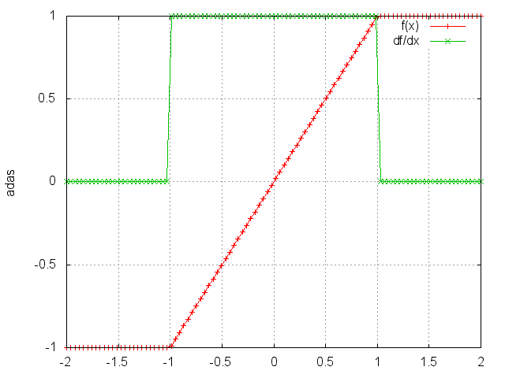
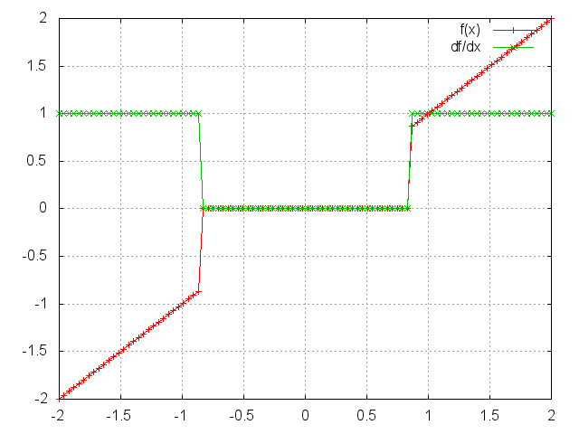
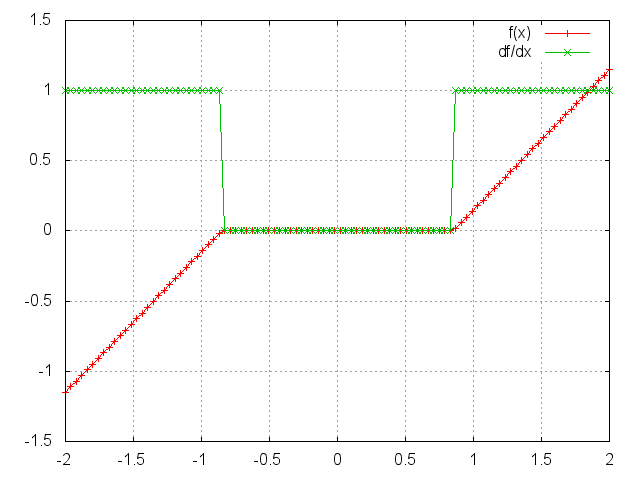
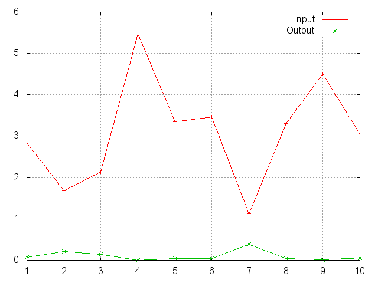
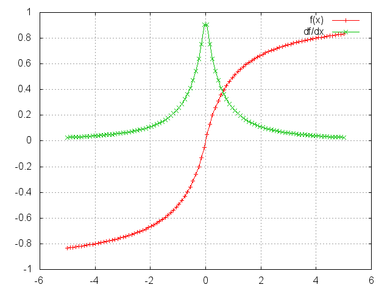
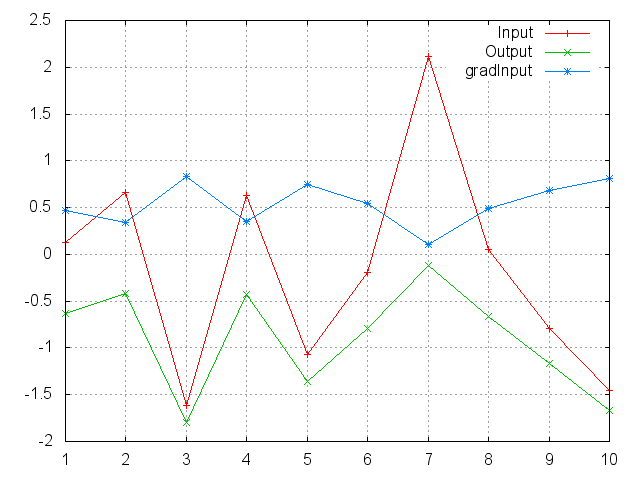
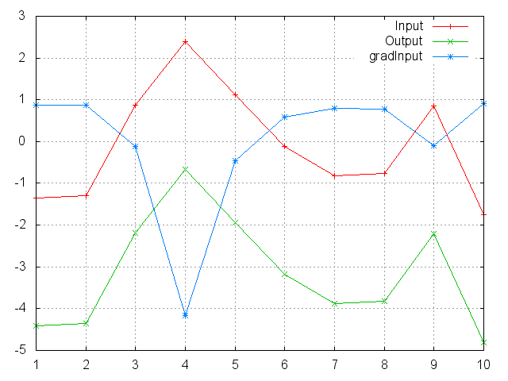
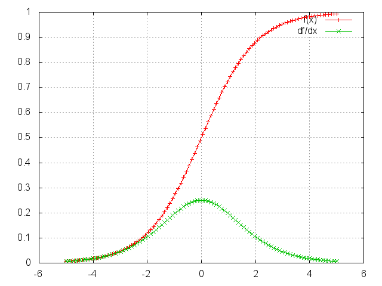
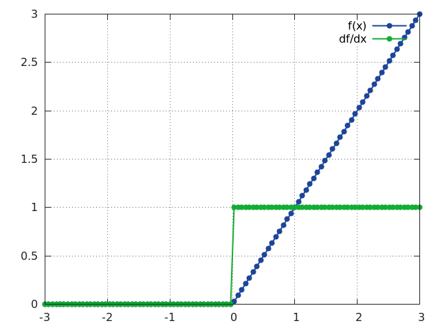
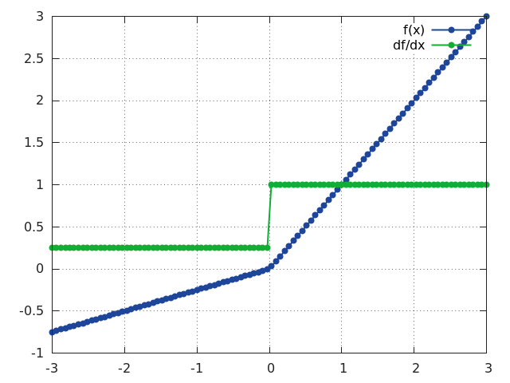

<a name="nn.transfer.dok"></a>
# 전달 함수 층 #
전달 함수들은 보통 [Linear](simple.md#nn.Linear)와 [SpatialConvolution](convolution.md#nn.SpatialConvolution) 같은 파라미터화 층 뒤에 비선형성을 만들기 위해 사용됩니다. 비선형성들은 그 문제 공간을 단순한 로지스틱 회귀기가 허용하는 것보다 더 복잡한 영역들로 나눌 수 있게 합니다. 

<a name="nn.HardTanh"></a>
## HardTanh ##

입력 텐서에 `HardTanh` 함수를 요소별로 적용합니다. 
따라서 같은 차원을 가진 텐서 하나를 출력합니다.

`HardTanh`는 다음과 같이 정의됩니다:

  * `f(x)` = `1, 만약 x >`  `1,`
  * `f(x)` = `-1, 만약 x <`  `-1,`
  * `f(x)` = `x,` `그렇지않으면`

선형 영역의 범위 `[-1 1]`는 선언에서 인자를 특정함으로써 조절될 수 있습니다. 예를 들어
 `nn.HardTanh(min_value, max_value)`.
그렇지않으면, `[min_value max_value]`는 기본적으로 `[-1 1]`로 설정됩니다.


```lua
ii=torch.linspace(-2,2)
m=nn.HardTanh()
oo=m:forward(ii)
go=torch.ones(100)
gi=m:backward(ii,go)
gnuplot.plot({'f(x)',ii,oo,'+-'},{'df/dx',ii,gi,'+-'})
gnuplot.grid(true)
```



<a name="nn.HardShrink"></a>
## HardShrink ##

`module = nn.HardShrink(lambda)`

Hard shrinkage 함수를 요소별로 입력 
[텐서](https://github.com/torch/torch7/blob/master/doc/tensor.md)에 적용합니다.
 출력의 차원은 입력과 같습니다.

`HardShrinkage` 연산자는 다음과 같이 정의됩니다:

  * `f(x) = x, 만약 x > lambda`
  * `f(x) = x, 만약 x < -lambda`
  * `f(x) = 0, 그렇지않으면`

```lua
ii=torch.linspace(-2,2)
m=nn.HardShrink(0.85)
oo=m:forward(ii)
go=torch.ones(100)
gi=m:backward(ii,go)
gnuplot.plot({'f(x)',ii,oo,'+-'},{'df/dx',ii,gi,'+-'})
gnuplot.grid(true)
```


<a name="nn.SoftShrink"></a>
## SoftShrink ##

`module = nn.SoftShrink(lambda)`

Soft shrinkage 함수를 요소별로 입력 
[텐서](https://github.com/torch/torch7/blob/master/doc/tensor.md)에 적용합니다.
 출력의 차원은 입력과 같습니다.

`SoftShrinkage` 연산자는 다음과 같이 정의됩니다:

  * `f(x) = x-lambda, 만약 x > lambda`
  * `f(x) = x+lambda, 만약 x < -lambda`
  * `f(x) = 0, 그렇지않으면`

```lua
ii=torch.linspace(-2,2)
m=nn.SoftShrink(0.85)
oo=m:forward(ii)
go=torch.ones(100)
gi=m:backward(ii,go)
gnuplot.plot({'f(x)',ii,oo,'+-'},{'df/dx',ii,gi,'+-'})
gnuplot.grid(true)
```



<a name="nn.SoftMax"></a>
## SoftMax ##

`Softmax` 함수를 한 n차원 입력 텐서에 적용합니다. n차원 출력 텐서의 요소들이 (0,1) 범위에 있고 더해서 1이 되도록 그 요소들의 크기를 재조정합니다. 

`Softmax`는 `f_i(x)` = `exp(x_i-shift) / sum_j exp(x_j-shift)`로 정의됩니다,
여기서 `shift` = `max_i x_i`입니다.


```lua
ii=torch.exp(torch.abs(torch.randn(10)))
m=nn.SoftMax()
oo=m:forward(ii)
gnuplot.plot({'Input',ii,'+-'},{'Output',oo,'+-'})
gnuplot.grid(true)
```


유념하십시오. 이 모듈은 [ClassNLLCriterion](criterion.md#nn.ClassNLLCriterion)와 직접적으로 함께 동작하지 않습니다. 
그것은 `SoftMax`와 그 자신 사이에 `nn.Log`가 계산되길 기대합니다. 대신 [LogSoftMax](#nn.LogSoftMax)를 사용하십시오 (더 빠릅니다).


<a name="nn.SoftMin"></a>
## SoftMin ##

`Softmin` 함수를 한 n차원 입력 텐서에 적용합니다. n차원 출력 텐서의 요소들이 (0,1) 범위에 있고 더해서 1이 되도록 그 요소들의 크기를 재조정합니다. 

`Softmin`은 `f_i(x)` = `exp(-x_i-shift) / sum_j exp(-x_j-shift)`로 정의됩니다,
여기서 `shift` = `max_i -x_i`입니다.


```lua
ii=torch.exp(torch.abs(torch.randn(10)))
m=nn.SoftMin()
oo=m:forward(ii)
gnuplot.plot({'Input',ii,'+-'},{'Output',oo,'+-'})
gnuplot.grid(true)
```


<a name="nn.SoftPlus"></a>
### SoftPlus ###

`SoftPlus` 함수를 한 n차원 입력 텐서에 적용합니다.
`SoftPlus`는 [ReLU](#nn.ReLU) 함수로의 부드러운 근사치입니다. 그리고 한 기계의 출력이 항상 양수가 되도록 제한하는 데 사용될 수 있습니다. 수치적 안정성을 위해, 실제 구현은 특정 값(기본값은 20) 이상의 입력은 선형 함수로 되돌립니다.

`SoftPlus`는 `f_i(x)` = `1/beta * log(1 + exp(beta * x_i))`로 정의됩니다.

```lua
ii=torch.linspace(-3,3)
m=nn.SoftPlus()
oo=m:forward(ii)
go=torch.ones(100)
gi=m:backward(ii,go)
gnuplot.plot({'f(x)',ii,oo,'+-'},{'df/dx',ii,gi,'+-'})
gnuplot.grid(true)
```


<a name="nn.SoftSign"></a>
## SoftSign ##

`SoftSign` 함수를 한 n차원 입력 텐서에 적용합니다.

`SoftSign`은 `f_i(x) = x_i / (1+|x_i|)`로 정의됩니다.

```lua
ii=torch.linspace(-5,5)
m=nn.SoftSign()
oo=m:forward(ii)
go=torch.ones(100)
gi=m:backward(ii,go)
gnuplot.plot({'f(x)',ii,oo,'+-'},{'df/dx',ii,gi,'+-'})
gnuplot.grid(true)
```


<a name="nn.LogSigmoid"></a>
## LogSigmoid ##

`LogSigmoid` 함수를 한 n차원 입력 텐서에 적용합니다.

`LogSigmoid`는 `f_i(x)` = `log(1/(1+ exp(-x_i)))`로 정의됩니다.


```lua
ii=torch.randn(10)
m=nn.LogSigmoid()
oo=m:forward(ii)
go=torch.ones(10)
gi=m:backward(ii,go)
gnuplot.plot({'Input',ii,'+-'},{'Output',oo,'+-'},{'gradInput',gi,'+-'})
gnuplot.grid(true)
```



<a name="nn.LogSoftMax"></a>
## LogSoftMax ##

`LogSoftmax` 함수를 한 n차원 입력 텐서에 적용합니다.

`LogSoftmax`는 `f_i(x)` = `log(1/a exp(x_i))`로 정의됩니다. 여기서 `a` = `sum_j exp(x_j)`입니다.

```lua
ii=torch.randn(10)
m=nn.LogSoftMax()
oo=m:forward(ii)
go=torch.ones(10)
gi=m:backward(ii,go)
gnuplot.plot({'Input',ii,'+-'},{'Output',oo,'+-'},{'gradInput',gi,'+-'})
gnuplot.grid(true)
```


<a name="nn.Sigmoid"></a>
## Sigmoid ##

`Sigmoid` 함수를 요소별로 한 입력 텐서에 적용합니다. 따라서 같은 차원을 가진 텐서 하나를 출력합니다.

`Sigmoid`는 `f(x)` = `1/(1+exp(-x))`로 정의됩니다.

```lua
ii=torch.linspace(-5,5)
m=nn.Sigmoid()
oo=m:forward(ii)
go=torch.ones(100)
gi=m:backward(ii,go)
gnuplot.plot({'f(x)',ii,oo,'+-'},{'df/dx',ii,gi,'+-'})
gnuplot.grid(true)
```


<a name="nn.Tanh"></a>
## Tanh ##

`Tanh` 함수를 요소별로 입력 텐서에 적용합니다. 따라서 같은 차원을 가진 텐서 하나를 출력합니다.

`Tanh`는 `f(x)` = `(exp(x)-exp(-x))/(exp(x)+exp(-x))`로 정의됩니다.

```lua
ii=torch.linspace(-3,3)
m=nn.Tanh()
oo=m:forward(ii)
go=torch.ones(100)
gi=m:backward(ii,go)
gnuplot.plot({'f(x)',ii,oo,'+-'},{'df/dx',ii,gi,'+-'})
gnuplot.grid(true)
```


<a name="nn.ReLU"></a>
## ReLU ##

정류된 선형 유닛(`ReLU`) 함수를 요소별로 그 입력 텐서에 적용합니다. 따라서 같은 차원을 가진 텐서 하나를 출력합니다.

`ReLU`는 `f(x)` = `max(0,x)`로 정의됩니다.

`ReLU`는 선택적으로 추가적 상태 메모리 사용 없이 그 연산을 제자리에서 수행할 수 있습니다.
```lua
m=nn.ReLU(true) -- true = 제자리, false = 별도의 상태 유지.
```

```lua
ii=torch.linspace(-3,3)
m=nn.ReLU()
oo=m:forward(ii)
go=torch.ones(100)
gi=m:backward(ii,go)
gnuplot.plot({'f(x)',ii,oo,'+-'},{'df/dx',ii,gi,'+-'})
gnuplot.grid(true)
```


<a name="nn.PReLU"></a>
## PReLU ##

파라미터적 ReLU를 적용합니다. 이 함수의 파라미터는 음수 부분의 기울기를 바꿉니다.

`PReLU`는 `f(x)` = `max(0,x) + a * min(0,x)`로 정의됩니다.

```nn.PReLU()``` 처럼 입력에 숫자가 없이 호출될 때는 공유된(shared) 버전을 사용합니다. 의미는 오직 파라미터 하나를 가진다는 뜻입니다. 그렇지 않고, 만약 각 입력 맵 하나를 위한 ```nOutputPlane``` 파라미터를 가진 ```nn.PReLU(nOutputPlane)```로 호출되면, 그 출력 차원은 항상 입력 차원과 같습니다. 가중치 쇠퇴가 거기에 사용되면 안됨에 유념하십시오. [Delving Deep into Rectifiers](http://arxiv.org/abs/1502.01852)를 참고하십시오.



<a name="nn.SpatialSoftMax"></a>
## SpatialSoftMax ##

특징들에 대해 [SoftMax](#nn.SoftMax)를 각 공간적 위치(평면들의 높이 x 폭)에 적용합니다.
그 모듈은 1차원(벡터), 2차원(벡터들의 묶음), 3차원(공간에서의 벡터들), 또는 4차원(공간에서의 벡터들의 묶음) 텐서를 입력으로 받습니다.
1차원 또는 2차원 입력이 사용될 때, 기능적으로 이것은 [SoftMax](#nn.SoftMax)와 같습니다.
그 출력 차원은 항상 입력 차원과 같습니다.

```lua
ii=torch.randn(4,8,16,16)  -- 묶음크기(batchSize) x 특징(features) x 높이 x 폭
m=nn.SpatialSoftMax()
oo = m:forward(ii)
```

<a name="nn.AddConstant"></a>
## AddConstant ##

한 (학습할 수 없는) 스칼라 상수를 더합니다. 이 모듈은 때로 디버깅 용으로 유용합니다. 
 `f(x)` = `x + k`, 여기서 `k`는 스칼라.

AddConstant는 선택적으로 추가적 상태 메모리 없이 그 연산을 제자리에서 수행할 수 있습니다.
```lua
m=nn.AddConstant(k,true) -- true = 제자리, false = 별도의 상태 유지.
```
제자리 모드는 백워드 패스(backward pass) 뒤에 원래 입력 값을 복원합니다. [MulConstant](#nn.MulConstant) 같은 다른 제자리 모듈들 다음에도 그것을 사용할 수 있습니다.

<a name="nn.MulConstant"></a>
## MulConstant ##

입력 텐서를 (학습할 수 없는) 스칼라 상수로 곱합니다. 이 모듈은 디버깅에 때로 유용합니다.
`f(x)` = `k * x`, 여기서 `k`는 스칼라입니다.

MulConstant는 선택적으로 추가적 상태 메모리 없이 제자리에서 그 연산을 수행할 수 있습니다.
```lua
m=nn.MulConstant(k,true) -- true = 제자리, false = 별도의 상태 유지.
```
제자리 모드는 백워드 패스(backward pass) 뒤에 원래 입력 값을 복원합니다. [AddConstant](#nn.AddConstant) 같은 다른 제자리 모듈들 다음에도 그것을 사용할 수 있습니다.
